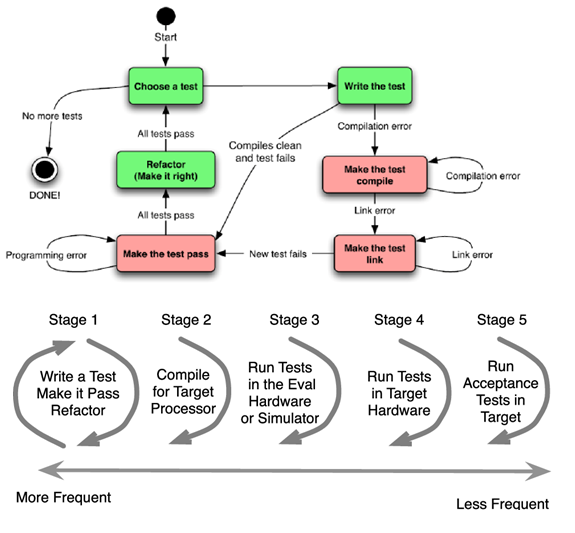

# TDD Concepts
Terms, ideas, and outlooks defined by test driven development.

## Index
- [“-ilities” reinforced by TDD/DevOps/Agile](#-ilities-reinforced-by-tdddevopsagile)
- [TDD Workflow](#tdd-workflow)
- [TDD Jargon](#tdd-jargon)
- [TDD Key Concepts](#tdd-key-concepts)
- [Bad code](#bad-code)
- [Handling Dependencies](#handling-dependencies)
- [CppUTest](#cpputest)
- [Test coverage tools](#test-coverage-tools)

## “-ilities” reinforced by TDD/DevOps/Agile
  - Maintainability
  - Manageability
  - Scalability
  - Reliability
  - Testability
  - Deployability
  - Security

## TDD Workflow
  - Write list of test cases ->
  - Begin cycle of writing tests and production code ->
    - Write minimal test code ->
      - New test case->
      - See compilation failure from reference to non-existent test macro ->
      - Define test macro ->
      - See linking failure from call to non-existent production code ->
      - Implement empty production code function ->
      - See failing test ->
    - Write minimal production code (bare minimum, including hard coded solutions) ->
    - Note weaknesses realized from hard coded solutions (add to test list) ->
    - Refactor test fixture and production code if test cases are passing ->
      - Test fixture:
  - Add helper test macros to factor out repeated behavior
      - Production code:
  - Static global variables to represent and factor out fake hardware registers
  - Static helper functions to factor out repeated/complex/difficult to read behavior
  - Static enumerations for masks, constants, etc
    - Repeat until all test cases are exhausted ->

## TDD Jargon
  - Test fixture
    - Set of tests and the source file compiled together with the tests written for a particular interface
  - Test harness
    - Set of libraries and an environment for a user to begin writing tests for an interface
    - Includes Unity and CppUTest
  - Test double, aka test stub
    - An impersonation of some function/data/module/library
    - Includes mocks and fakes
    - Use-cases:
      - Hardware independence
      - Inject difficult to produce input(s)
      - Speed up a slow collaborator (dependency)
      - Dependency on something volatile 
        - Time/clock, etc
      - Dependency on something under development
      - Dependency on something difficult to configure a database, etc
  - Test code
    - Code written to test a particular interface
  - Test case
    - Code that describes/tests a particular behavior of the code under test
  - Test dummy
    - Empty stub to prevent a linker from rejecting a build
    - Used when replacing an entire DOC, and when you have functions in the DOC that aren’t called in your interface
  - Mock object
    - Object that verifies the functions called, call order, and parameters passed from the code under test to DOC
    - Programmed to return a specific value to the code under test
    - Used when a function in a DOC is called multiple times, and each call/response is potentially different
  - Fake object
    - Partial implementation for a replaced component
    - Usually provides specific values/implementations just like mock objects
    - Exploding fake
      - Causes test to fail if called
  - Unit testing
    - A test written to verify the behavior of a particular unit (function in an interface)
  - Abstract data type
    - A module who’s data is private, and defined by the operations that may be performed on it
    - Ex: a circular buffer struct type might be defined in a header using a forward struct declaration- user can’t see how it’s implemented, but it’s tossed around by functions in the circular buffer interface
  - Single-instance module 
    - A module that has a single collection of data to manage
    - No need for tossing around an instance of an abstract data type into functions
    - Ex: an LED interface responsible for a particular set of LED’s on a board
  - Multiple-instance module
    - A module that a user can create multiple instances of
    - Must pass in abstract data type (the particular instance) to functions 
    - Ex: a circular buffer module 
  - TDD state machine and cycle
    -  

## TDD Key Concepts
  - 3 TDD rules
    - Production code may only be written in response to a failing test
    - Don’t write more tests than needed to create a single failure (build failures are failures)
    - Don’t write code ahead of tests
    - Benefits:
      - This way you guarantee a test for all production code behaviors
      - Write/modify test cases until you see the need for production code to upgrade to resolve a way for production code to fail
  - Use forward struct declarations to hide typedef internals in header files
  - Use return statements as needed
    - If you write functions to be short and to adhere to single-responsibility principle, there will never be a crazy cluster of return statements
  - Create tests in order of 0-1-N when there’s a collection of related cases to test
  - Refactor on green
    - Factor out and simplify tests/production code only when all tests are passing, and when everything is compiling
  - Static file scope variables as a test doubles for hardware registers
    - A simple global file scope variable serves as a fake hardware register
  - Frequently save and test
    - Tests should run quickly- could run in response to every file save
  - Do the simplest thing that could possibly work
    - Production code should be written in stages- from wrong hardcoded solutions up to how a chip vendor might implement something if they had factored and decoupled everything possible
    - The collection of tests created through this process will all be correct and useful to verify software behavior
  - 4-phase test pattern
    - Setup
      - Establish preconditions to the test
    - Exercise
      - Do something to the system
    - Verify
      - Check the expected outcome
    - Cleanup
      - Return system under test to initial state after the test
  - Code smells, code rot, and refactoring
    - Refactor/simplify tests and production code in response to every successful cycle of writing a test and updating production code
    - Generates code-rot free interfaces by handling all code smells on the spot
    - Don’t cut- copy, build, then delete
      - Don’t ever cut when refactoring- create a new bridge, verify bridge, then burn old bridge to maintain steady development
  - Unit test rules- FIRST
    - Fast
      - Run tests with every small change
    - Isolated
      - Tests shouldn’t set anything up for other tests
      - Isolates all failures
    - Repeatable
      - Should be able to run in a loop, and perform the same test every time
    - Self-verifying
      - Provide OK for pass, concise details in response to failures
    - Timely	
      - Write every test right before the production code
  - DRY (“Don’t repeat yourself”)
    - Minimize duplicate code (in both tests and production code)
  - Dual targeting
    - When the target environment and the testing environment are different, you write portable and platform-agnostic code
  - If something is important enough to check in production code, then it’s important enough to write a test for it
  - “Extreme programming” 4 rules for simple design
    - Runs all tests
    - Expresses every idea needed to be expressed
      - Code should be self-documenting- clearly show the intention of the programmer
      - Don’t write comment blocks
    - Says everything once and only once
      - Eliminate all duplication
    - Has no superfluous parts
      - Don’t add in things that aren’t yet needed
  - “Extreme programming” motto
    - Make it work
    - Make it right
    - Make it fast
  - 3 critical refactoring skills
    - Identify bad code
      - Don’t categorize just based on your code vs others’ code
      - Identify what’s wrong w/ both your own and others’ code
    - Envision better code
      - Envision a better solution following SOLID principles
    - Transform the code
      - Slowly change the code- write new code without deleting old code, confirm that the new code works, then delete old code

## Bad code
  - Duplicate code
  - Bad names 
    - Don’t use acronyms that aren’t widely known
    - Reveal the intended outcome through function identifiers, instead of writing out any internal details
  - Bad pasta
    - Spaghetti 
      - Dependencies left and right, layers and modules aren’t made clear
    - Lasagna
      - Software in layered architecture, loosely coupled together
      - Lasagna invites spaghetti within each layer, but still better than just spaghetti
    - Ravioli
      - Small self-contained packets, all loosely coupled w/ tomato sauce
      - Could lead to processing spread out too much across all the packets, but usually this isn’t a problem
  - Long functions 
    - It’s too long if it can’t quickly fit into your head
    - A single switch statement with no nesting can fit into your head, but an ugly mess of nesting, long expressions, etc doesn’t fit int your head even if it’s less than a page or x number of lines specified in a company’s coding standards
    - Factor out all individual concepts/processes to reduce a function to implement just a single high task declared by its function name, following single-responsibility principle
  - Abstraction distraction
    - Don’t mix low level manipulation with function calls that abstract similar low level manipulation
    - Add additional abstraction to keep the level of abstraction consistent in functions and in a particular scope
  - Bewildering boolean
    - Don’t write long boolean expressions- factor out the expression into a private function
  - Switch case disgrace
    - Don’t nest things under switch case statements
    - Try to reduce the number of cases too
  - Duplicate switch case
    - If switch case logic is duplicated just w/ different actions, it’s time to think of an alternative- apply open-close principle
  - Nefarious nesting
    - Again, minimize nesting
    - Abstract out the contents inside of loops and conditional statements to maintain minimal layers to think about for both you and others 
  - Feature envy
    - If objects/functions demand shared data/objects to be passed around and manipulated, there’s “feature envy”
    - Isolate data manipulation for single instance modules, and follow data abstraction for multiple instance modules
  - Long parameter list
    - When a parameter list is copied across multiple functions, it’s time to write a new struct module and take that as a parameter instead 
    - We want to minimize struct use, since padding and memory allocation for structs are target dependent- use explicit data types as struct members 
  - Willy-nilly initialization
    - A lack of a distinct initialization function forces you to initialize structs and variables in tests for legacy code
    - Add the initialization functions to the production code
  - Global free-for-all
    - This includes file scope and completely global variables
    - Horrible for testing, and for creating independent functions and modules
    - If they need to exist, create functions to initialize and manipulate the globals
    - If the global is a struct, create an abstract data type
  - Comments
    - Comments are used as deodorant to hide bad code
    - Code should be simple enough to explain itself
    - Use comments when code can’t be structured in a self-explanatory way (when necessary optimizations are in place, etc)
    - Outdated comments turn into lies
    - Don’t leave commented out code in a repository
  - Conditional compilation
    - Hard to follow, and makes development impossible
    - Use the linker and compiler instead- create new implementation source files instead 
  - Copy-paste-tweak-repeat
    - Especially prominent when writing tests
    - Duplication occurs when you copy and paste w/ small modifications- make sure to add refactoring to the cycle

## Handling Dependencies
  - Link time substitution 
    - Used to replace an entire DOC with fakes/mocks
  - Function pointers
    - Used to replace individual function calls (from DOC’s) in your interface with mocks/fakes
    - Extern a function pointer, replace calls to use function pointer, and reassign function pointer 
  - Preprocessor substitution 
    - Avoid if possible
    - You can directly override function names in a file by doing 
      - #define functionname mockfunctionname
    - Difficult to work w/, since changes cascade everywhere 
  - Spies (mocks with extra variables to track data passed to it)
    - Used to verify behavior going down to DOC’s (“depended on components”)
  - Bare-bones fakes 
    - Used when in need of certain output values from DOC’s to test an interface that’s being written
  - CppUMock
    - Library designed for users to mock out dependencies when using CppUTest

## CppUTest
  - Test harness to test both C++ and C interfaces
  - Written in C++
  - Automatically adds test cases to the runner, in contrast to Unity

## Test coverage tools
  - gcov (“GNU coverage”) & lcov (“LTP Gcov”, “Linux test project”) come together w/ gcc, and works w/ CppUTest
  - gcov is the command line interface, lcov provides HTML output

## Others
add new items here