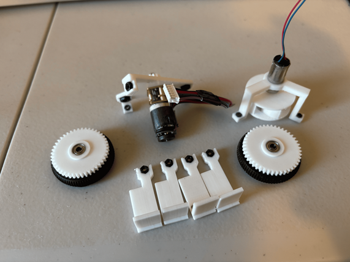
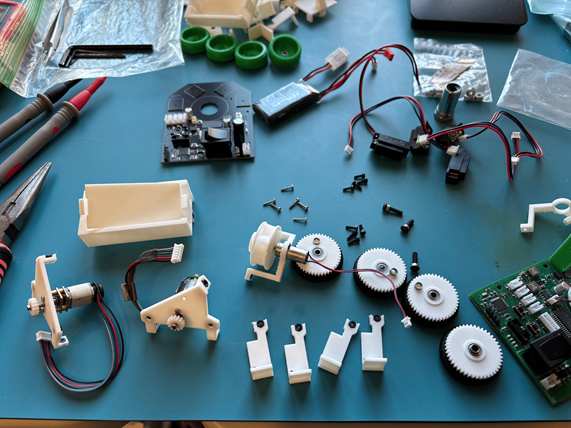
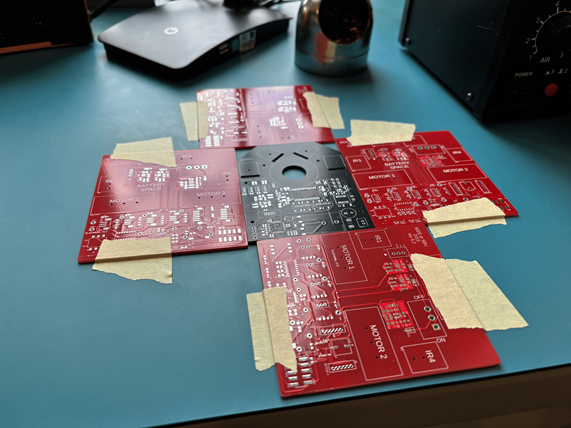
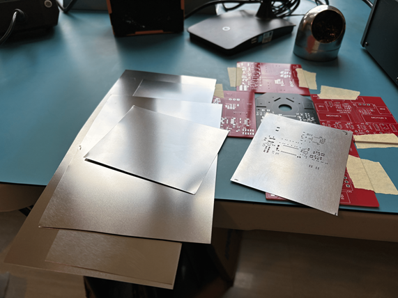
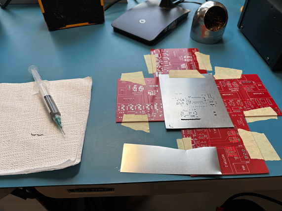
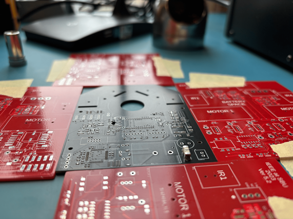
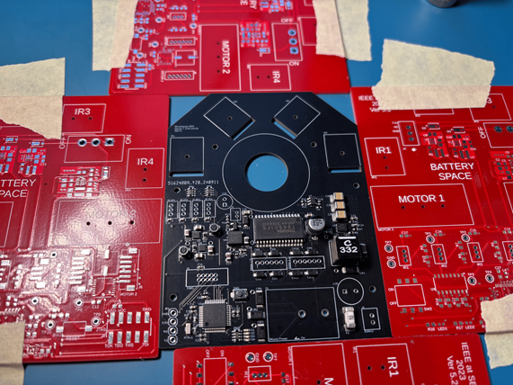
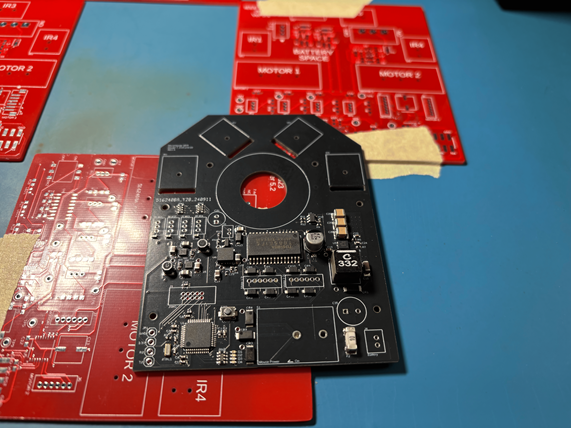
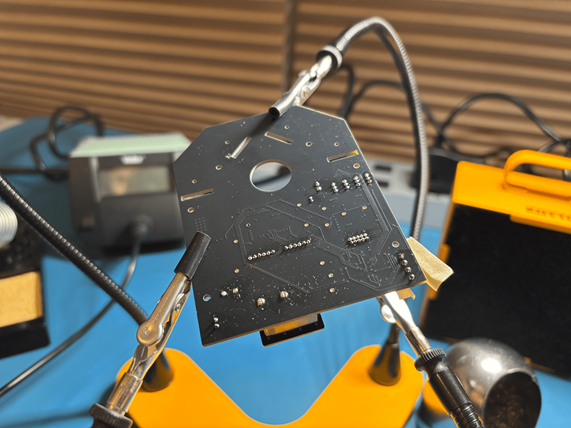

# Assembly Design Guide

- Micromouse assembly notes

## Index

- [3D Printing](#3d-printing)
- [Mechanical Assembly](#mechanical-assembly)
- [Soldering](#soldering)
- [Crimping](#crimping)

## 3D Printing

- When 3D printing mounts, wheels, gears, etc, make sure to:
  - Max out the quality of the print
    - High-quality prints take time, but it's easier to print w/ more time than to sand down parts
  - Print on a surface that doesn't have any quality-sensitive features
    - The first layer is the worst- everything else will be printed the best they can be
    - Gear teeth, hex nut cutouts, etc are "quality-sensitive"

## Mechanical Assembly

- 
  - When you superglue the ball bearings and nuts into the 3D printed mounts, make sure to:
    - Not apply too much superglue such that you have glue in threads, gear teeth, bearing rings, etc
    - Leave the parts alone for the rest of the day to dry
  - Use pliers and a hammer to get nuts and bearings in place as needed- make sure all parts are flush
- 
  - After the super glue is dry, you just have to screw everything together
  - You can assemble everything together as needed- it's nice to have a naked PCB for easy electrical/software testing

## Soldering

- Given the bot PCB has both surface-mount and through-hole components just on the top layer, the steps are:
  - Solder surface-mount components w/ a hot-air/rework station
  - Solder through-hole components manually w/ a regular soldering iron
- 
  - Hold down your PCB in place- this is crucial for when you apply solder paste w/ the stencil
  - You can do this w/ old PCBs or w/ anything else
- 
  - Cut your stencil for easy lifting and lowering on your PCB
- 
  - Tape your stencil on top of the PCB such that the holes on the stencil match the pads on the PCB
  - Do this w/ good lighting- the tiny leads are easy to miss
- 
  - Cut out a piece of the remaining stencil that you set aside to throw away- you can use the flat side to slide solder paste across the stencil
  - Apply a generous amount of solder paste as a line next to the stencil holes, and slowly slide the stencil cutout across the stencil
    - Try to evenly apply pressure to ensure that solder gets to all pads
    - The first couple times you'll either miss some pads, misalign the stencil, apply too much/little solder paste, etc
    - Don't try to brute force your way w/ a poor job of applying solder paste
      - You won't be able to recover after you move on to placing components down and using the hot-air station
      - Start over- wipe both the stencil and PCB clean w/ 99% isopropyl alcohol and be careful
- 
  - After you're satisfied w/ the solder paste job, go ahead and start placing components down carefully w/ a tweezer
  - Make sure to have your components inventory spreadsheet on the side to update w/ the components you used
    - Don't save this for later- you'll forget the components that you lost (small caps, resistors, etc) or broke/damaged
  - Try to start w/ the harder components while you have full view of the PCB w/ no components in the way (QFN IC's, etc)
  - Make sure to refer to your schematic, layout, and BOM as you place down components to ensure correct orientation and component selection
- 
  - Placement complete- you can move on to the hot-air station
  - Carefully apply hot air to the PCB- 300 degrees Celsius is good for lead solder
  - When you first approach the board w/ the hot-air gun, do it slowly to avoid thermal shock
  - Most components should tuck themselves in place thanks to the flux in the solder paste
  - ...Sometimes components will start lifting or moving out of place- poke them in place
  - If you see solder bridging, you're either screwed if it's a QFN package, or hope that you can salvage it later w/ desoldering wicks
- 
  - Remove your board and check for solder bridges again
  - Sometimes you'll see solder balls from excess solder- remove them if they're loose using tweezers
- 
  - Last is the through-hole components- this is a lot easier
  - The only notes is that:
    - Helping hands help keep the board in place in the air when soldering from the bottom
    - You should tape each component to the board before you start soldering so that the components remain flush on the board as you solder
    - Bending the leads on components help keep the components flush, but it's not enough (some components don't have long leads too)

## Crimping

- Crimping guide: https://iotexpert.com/jst-connector-crimping-insanity/
  - ...Apparently it's painful- we'll test it out to reduce IR sensor wire lengths
