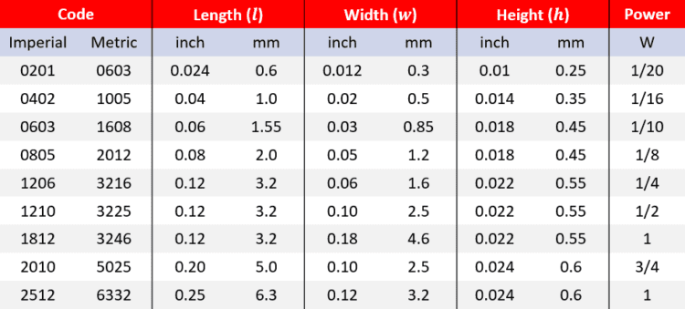

# PCB Design

- PCB design tips notes
- More notes and advice in `fundamental-engineering-notes` repo and in key books

## DRC

- PCB's need to follow a set of rules for a PCB vendor to be able to fabricate your design
- "design rule checker" for JLC PCB: https://github.com/oxullo/jlcpcb-eagle/tree/master/design%20rules

## PCB Traces

- Use Saturn PCB Design tool to ensure that traces are wide enough to carry the desired current
- 
  - Even if your regulator circuit can provide 5A, 35 mil traces can only carry 3A

## Component Placement Planning

- There needs to be a plan before placing down components on a PCB
- Provided we want the micromouse to be as small as possible, go down the line of space constraining parts (vacuum hole, IR sensor mounts, wheel motor mounts, etc) and design a processor pinout to optimally place components so there's minimal thinking needed when routing traces
- 
  - color coding MCU pinout based on component placement on the board

## Resistors

- 
  - 0805 are very large and easy to solder- incorporate in design when necessary
  - 0603 are solderable- incorporate in design when necessary
  - 0402 is the smallest package that's comfortable to solder- use for all general use-cases
  - ...Anything smaller demands extra care
- Use low ESR and ESL resistors

## Capacitors

- Altium's capacitor article: https://resources.altium.com/p/which-type-capacitor-should-you-use
- Tantalum capacitor's aren't great- ceramic perform better
- Polymer capacitors are good to replace electrolytic capacitors, but they're more expensive in exchange for better performance
