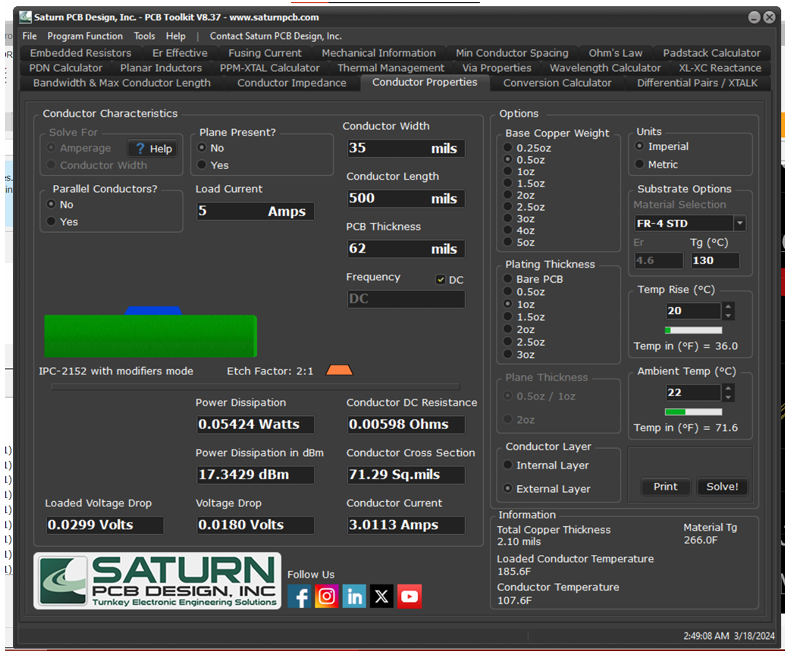
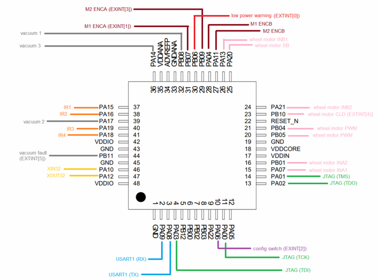
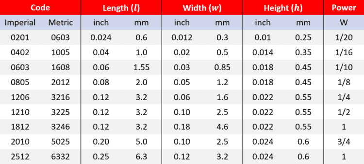

# Electrical Design Guide
All micromouse electrical design tips and know-how.
- May include:
    - PCB tips
    - Schematic tips

## Circuit Design
- **Power**
  - Switching Regulators vs Linear Regulators
    - switching regulators are the way to go: https://www.rohm.com/electronics-basics/dc-dc-converters/linear-vs-switching-regulators
  - Texas Instruments
    - TI provides a fantastic tool to generate power circuits: https://webench.ti.com/power-designer/switching-regulator
    - TI provides the best datasheets to begin w/ anyway even if you were to manually design a regulator circuit 

- **Battery Type**
  - LiPo is the best, by University of Nevada: https://www.physics.unlv.edu/~bill/ecg497/Drew_Tondra_report.pdf
    - best for performance and rechargeability
  - LiPo Batteries Demand Extra Care
    - LiPo analysis video: https://www.youtube.com/watch?v=Lk7wzVYmXSA
    - understanding LiPo specs: https://www.rchelicopterfun.com/lipo-battery-ratings.html
    - prone to fires
      - never leave unattended when charging
      - DO NOT OVERCHARGE
      - DO NOT CHARGE IF BELOW DEAD VOlTAGE (~6.4V)
      - store in safe pouches when charging and when not in use

- **Electrical Protection & Noise Suppression**
  - Multi-Stage Decoupling
    - varying capacitors of differing capacitance to absorb noise and suppress spikes
    - low capacitance -> high frequency spikes
    - high capacitance -> low frequency bulk decoupling
  - Flyback Diode
    - why we need these
      - inductors store energy in a magnetic field while current flows
      - turning off a motor causes the motor's magnetic field to collapse
      - inductors resist changes in current, and try to keep current flowing- this causes high voltage spike in the reverse direction across the inductor
      - To safely dissipate excess power, there needs to be a diode that breaks down in response to such spikes
    - diode selection
      - breakdown voltage of 2-3 times normal voltage is good
      - schottky diodes are good for
        - low forward drop
        - less heating
        - faster recovery time if switching is fast
  - Order of Connecting Components to Ground
    - electronics stack exchange thread: https://electronics.stackexchange.com/questions/458538/feeding-microcontroller-and-linear-actuators-motors-with-the-same-power-supply
    - noisy components should be as close as possible to the power supply ground to mitigate ground loops and noise
  - Diode to Prevent Reverse Current
    - IEEE Berkely mentions they encountered an issue w/ current flowing from MCU to regulator: https://ieee.berkeley.edu/micromouse-lab-5/

## PCB Design
- **DRC**
  - PCB's need to follow a set of rules for a PCB vendor to be able to fabricate your design
  - "design rule checker" for JLC PCB: https://github.com/oxullo/jlcpcb-eagle/tree/master/design%20rules

- **PCB Traces**
    - Use Saturn PCB Design tool to ensure that traces are wide enough to carry the desired current
    - 
      - Even if your regulator circuit can provide 5A, 35 mil traces can only carry 3A

- **Component Placement Planning**
  - there needs to be a plan before placing down components on a PCB
  - provided we want the micromouse to be as small as possible, go down the line of space constraining parts (vacuum hole, IR sensor mounts, wheel motor mounts, etc) and design a processor pinout to optimally place components so there's minimal thinking needed when routing traces
  - 
    - color coding MCU pinout based on component placement on the board

- **Resistors**
  - 
    - 0805 are very large and easy to solder- incorporate in design when necessary
    - 0603 are solderable- incorporate in design when necessary
    - 0402 is the smallest package that's comfortable to solder- use for all general use-cases
    - ...anything smaller demands extra care
  - Use low ESR and ESL resistors

- **Capacitors**
  - Altium's capacitor article: https://resources.altium.com/p/which-type-capacitor-should-you-use
  - tantalum capacitor's aren't great- ceramic perform better
  - polymer capacitors are good to replace electrolytic capacitors, but they're more expensive in exchange for better performance