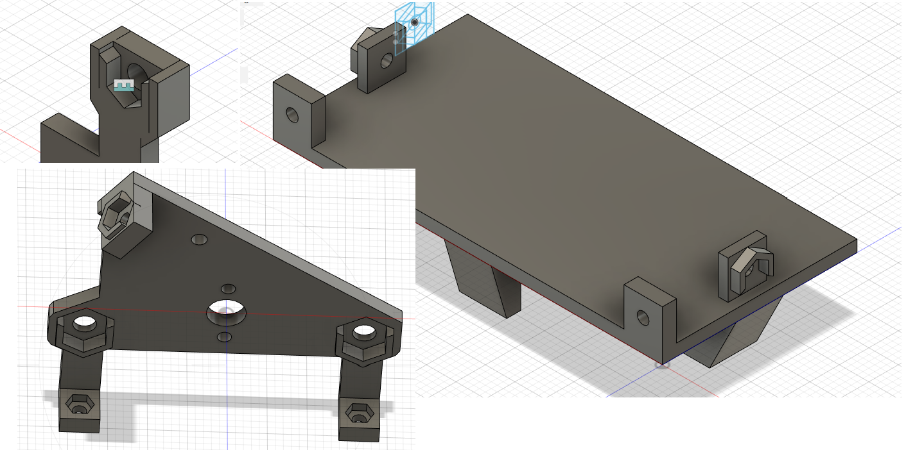
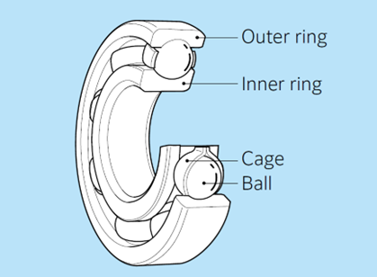
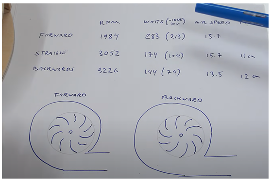
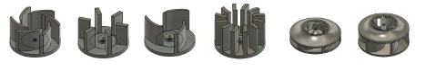

# Mechanical Design Guide
All micromouse mechanical design tips and know-how.
- May include:
    - 3D design guides for various parts
    - component selection tips

## Hex Nuts and Screws 
- **Sockets for 3D Printed Parts**
  - 
  - sockets added to superglue hex nuts into 3D mounts to avoid having to hold down hex nuts when assembling mounts on to the motherboard

## Wheel Bearing Spacers
  - 
  - needed to prevent outer ring of ball-bearings from touching 3D printed mounts and screw heads 
  - crucial that they're made of metal- tried to 3D print spacers, but they eventually mold into the shapes of the parts they're spaced between

## Vacuum Fan Designs
  - Lack of Documentation
    - very involved- wish we had a mechanical engineer on the team
    - for whatever reason, there's no documentation regarding micromouse vacuum fan designs
    - ...except for this: https://rt-net.jp/mobility/archives/20915
      - ^implements a turbo impeller fan <3

  - Different Impeller Fan Types Compared
    - video here: https://www.youtube.com/watch?v=mafjVYfFgg4
    - turbo fan provides the most suction

  - Impeller Fans
    - there is documentation on impeller fans in general
      - impeller blower configuration video: https://youtu.be/YuEaP9kyiFc?si=spyc_kHSI9guTJmH
      - impeller fan crafted by hand video: https://youtu.be/Hyz1TMbNVSo?si=MinbotT-jVyszSr6
    - puller configuration
      - 
        - when a fan's wings scoop the air, it's pusher configuration
        - when a fan's wings swing air out, it's puller configuration
        - in the above image, when the fan moves counter-clockwise it's the most efficient design in terms of power consumption and RPM

  - Failed Designs
    - 
    - reasons for failure include lack of suction, lack of durability (fan parts break apart), and noise
      - second to last failing design is intolerably loud
      - last design is essentially the working design, but a bit too tall and wide

  - Green Ye
    - http://greenye.net/Pages/Micromouse/Micromouse2016-2017.htm
    - Allocates 3cm to vacuum on PCB, and 1.5cm for the hole for suction
    - Mouse Unit 07 arbitrarily does the same

  - Excel-9a
    - video: https://www.youtube.com/watch?v=1_KpQ1bw5I8
    - documentation: https://sites.google.com/site/myprojectq/robotic/classic-micromouse/excel-9a?pli=1
    - the mouse that defies gravity

  - Micromouse Online
    - https://micromouseonline.com/2018/02/18/more-suck-less-slip/
    - yes, vacuum means less slip indeed

## Gears
  - Fusion 360 guide to making gears: https://www.youtube.com/watch?v=B8A_11o7QZ0

## PicoBlade vs JST
- confusing that these 8520 motors come w/ Molex PicoBlade connectors instead of JST
  - reddit: https://www.reddit.com/r/AskElectronics/comments/m6mibq/is_a_picoblade_125mm_connector_the_same_as_micro/?rdt=47452
  - blog: https://blog.kylemanna.com/hardware/molex-picoblade-vs-jst-sh-connectors/
- need to visually check whether connector demands blade-like pins or regular through-hole pins