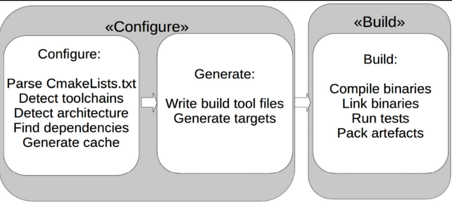
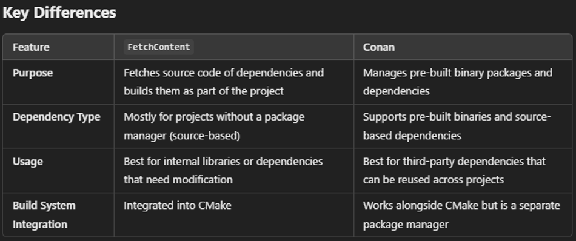
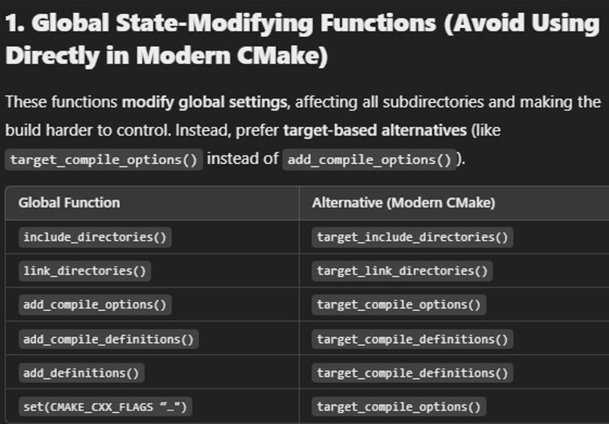
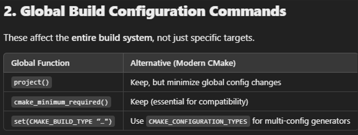
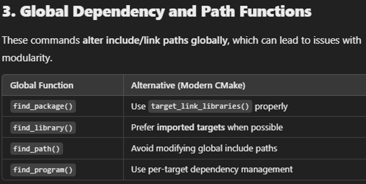
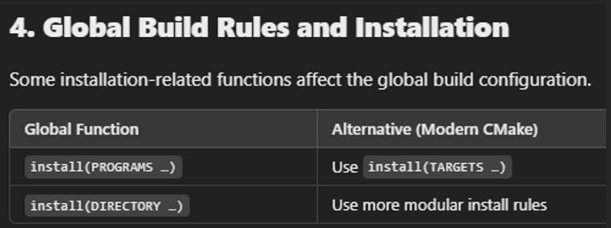
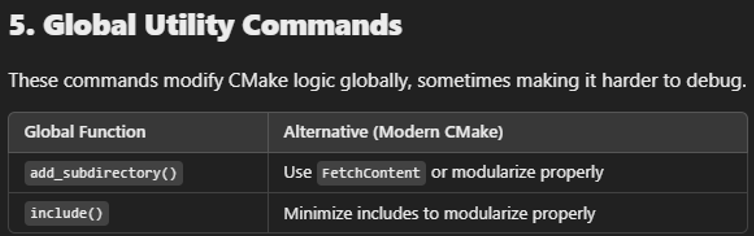
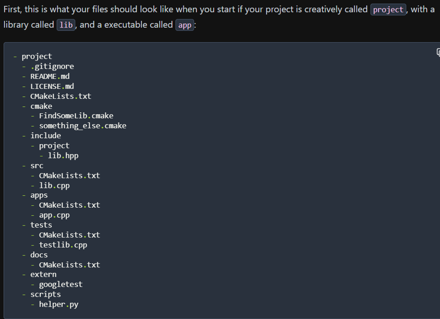
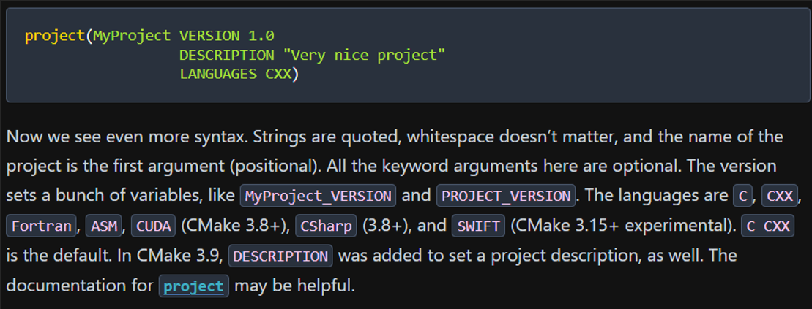

# CMake Guide
CMake concepts from *Introduction to Modern CMake* and *CMake Best Practices*

## Index
- [Overview](#overview)
- [Two-Step CMake Build Process](#two-step-cmake-build-process)
- [General Concepts](#general-concepts)
- [Do's and Don'ts](#dos-and-donts)
- [Ideal Directory Structure](#ideal-directory-structure)
- [Project Creation](#project-creation)
- [Migrating to CMake](#migrating-to-cmake)
- [Minimal CMakeLists.txt File](#minimal-cmakeliststxt-file)
- [Associated Tools](#associated-tools)
- [CMake Commands](#cmake-commands)
- [Associated Tools](#associated-tools)

## Overview
  - A uniform build system generator to configure build targets
  - The industry standard for customizing builds for production and testing
  - Automate testing, building, and deploying with seamless integration into a CI/CD pipeline
  - Easy customization and switching between toolchains and compilers used for building projects
  - Provides instructions for other build systems such as Makefile, Ninja, Visual Studio, Qt Creator, Android Studio, Xcode, etc
  - Allows for automated testing via configuring project build for testing
    - Works best in a Unix environment where all the support lies w/ automated testing
  - Supports cross-compiling- much easier to create build instructions for a variety of compilers and platforms without the need to know specifics of the respective build system in depth
  - Can discover system libraries and dependencies
  - Integrates well with package managers like Conan and vcpkg
  - Native support for testing, installing, and packaging software
  - Has minimal dependencies
  - Can run on command line without user interaction to integrate into CI/CD pipelines

## Two-Step CMake Build Process
  - Configure & build
  - 

## General Concepts
  - Properties
    - Values attached to a specific object or scope of CMake (file, target, directory, test case, etc)
  - Targets
    - What CMake uses to organize its build system to associate processes to
    - Target types include: executable, library, custom command or artifact like documentation
    - Created using:
      - `add _exectuable`
      - `add_library`
      - `add_custom_target`
  - Functions vs macros
    - Function 
      - Open a new scope for variables
      - Arguments are true variables
    - Macro
      - Do not open new scope for variables
      - Arguments are string replacements
      - Text replacement just like macros in C
  - “vendoring”
    - cloning a library and directly adding it as a subdirectory to a project- should be avoided
    - This is why packaging a project and using package managers to link dependencies to external libraries is a thing
  - Fetchcontent
    - CMake module that you can use to add source dependencies
    - Serves as an alternative to Git submodules
    - Great for building, downloading, and configuring dependencies into a project
    - Example use-case could be isolating an RTOS layer and vendor provided HAL into their own repositories to then be fetched by CMake when building a project
    - Fetchcontent and Conan aren’t mutually exclusive:
    -  
  - Fuzzing
    - Testing method to feed random unexpected data to a software system to see how a system behaves w/ certain inputs
  - Searching for files when cross-compiling pg 129
    - Relevant static and standard libraries are inside the toolchain folder
    - CMake variables are to be set in a toolchain file to make CMake search through the intended folders when linking static and standard libraries into a project
  - Treat CMake code as software- incorporate software design principles
    - Utilize functions and macros to abstract processes
  - ctest 
    - CMake’s test utility
    - used to detect and run tests
  - cpack
    - CMake’s packaging tool
    - used to package software into convenient installers
    - Used after a project is built to create an installable package (w/ documentation, etc)- different from Conan, which manages dependencies during the build process
  - CMake presets file
    - Used to store CMake configuration settings
    - You can treat it like a toolchain file or any other .cmake file, but this file is primarily used to abstract the CMake commands needed to run a build
    - Good for project-wide settings like build types, compilers, cache variables, testing, etc
    - Allows for nice encapsulated calls like:
      - `cmake --preset linux-debug`
      - `cmake --preset windows-release`

## Do’s and Don’ts

  - **Don’ts**
    - Global functions (link_directories, include_libraries)
      - 
      - 
      - 
      - 
      - 
    - Unneeded PUBLIC requirements (-Wall, etc)- make them PRIVATE instead
    - GLOB files- Make/other tools won’t know if you added files without re-running CMake
    - Link to built files directly- always link to targets instead
    - Never skip PUBLIC/PRIVATE when linking- causes all future linking to be keyword-less

  - **Do’s**
    - Treat CMake as code- clean and readable, following software design principles
    - Think in targets- create (IMPORTED) INTERFACE target for anything that should stay together
    - Export your interface- you should be able to run from build or install
    - Write a Config.cmake file if you’re a library author to support clients
    - Make ALIAS targets to keep usage consistent- using add_subdirectory and find_package should provide the same targets and namespaces
    - Combine common functionality into clearly documented functions or macros- functions are usually better
    - Use lowercase function names- uppercase is for variables
    - Use cmake_policy and/or range of versions

## Ideal Directory Structure
  - 

## Project Creation
  - 

## Migrating to CMake
  - High level
    - How individual parts of software (libraries/executables) are compiled and how they’re linked together
    - Which external dependencies are used, how they’re found, and how they’re used in the project
    - Which tests to build and how to run them
    - How the software is to be installed or packaged
    - Providing additional information like license information, documentation, changelogs, etc
  - Small project
    - (defined as any project contains only a few targets and which are usually all deployed together- self contained in a single repo)
    - Create CMakeLists.txt file inside root of projects
    - Identify targets and associated files in the project, and create appropriate targets inside the CMakeLists.txt file
    - Find all external dependencies and include paths, and add them to CMake targets where necessary
    - Identify the necessary compiler features, flags, and compiler definitions if any, and make them available to CMake
    - Migrate any tests to CTest by creating the necessary targets and calling add_test()
    - Identify any installation or packing instructions to CMake, including the need to install any resource files and more
    - Clean up and make the project nice- create presets, rearrange files/folders if necessary, and split up the CMakeLists.txt file if needed
  - Large project
    - Analyze what the dependencies, project hierarchy, and deployment units are
    - Decide on a migration strategy and whether a regular project structure or a superbuild is intended
    - Create or migrate the root project and pull in all not-yet-converted projects using ExternalProject, FetchContent, or intermediate find modules if working with binary packages
    - Handle project-wide dependencies using CMake
    - Convert the child-projects one-by-one into CMake
    - Change dependency handling to package manager if desired
    - Find common options and propagate them toward the root and create presets
    - When migrating the children, organize the packaging in CMake if not already done
    - Clean up, reorganize files and projects, improve performance, and more

## Minimal CMakeLists.txt File
```
cmake_minimum_required(VERSION 3.21)

project(
	“project_name”
	VERSION 1.0
DESCRIPTION “Brief description here” LANGUAGES CXX)

add_exectuable(Project_Name)
target_sources(Project_Name PRIVATE src/main.cpp)
```

## Associated Tools
  - VS code CMake extension
    - You can debug a project through VS Code as well
    - Clean builds can be specified when building w/ CMake
  - Conan
    - Conan is a decentralized package manager built on the client/server architecture- local clients fetches/uploads packages to one or more remote servers
    - Conan can create and manage binary packages for multiple platforms, configurations, and versions
    - A conanfile.py can list all dependencies, sources, and build instructions
    - Conan can be used directly from CMake if desired
    - Vcpkg
- another package manager that could be used to invoke tools and install dependencies
- centralized package manager by Microsoft
  - Doxygen
    - CMake can generate doxyfiles
    - Source code should follow Javadoc style
    - UML- “unified modeling language”
    - plantUML to generate custom diagrams

## CMake Commands
  - `cmake -G“Ninja” . -Bbuild`
    - creates make files as specified in CMakeLists file(s)
  - `cmake --build build`
    - creates an executable using the build files created using above `cmake -G“Ninja” . -Bbuild`

## Miscellaneous Notes
  - `set(CMAKE_SYSTEM_NAME Linux)`
    - This allows you to generate .o files instead of .obj files
    - ...but it doesn't really matter- object file contents will be identical
