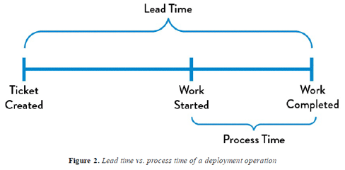
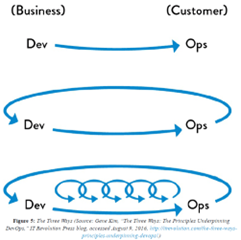
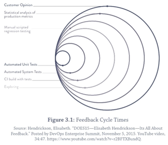
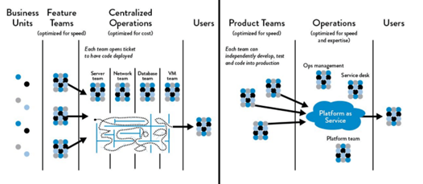
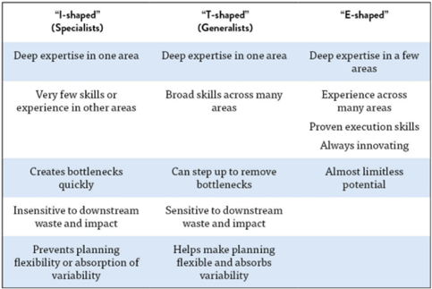
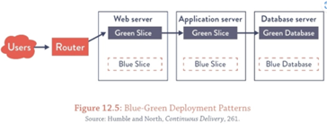
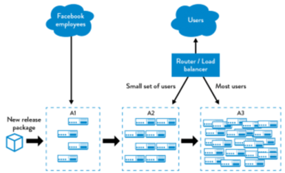
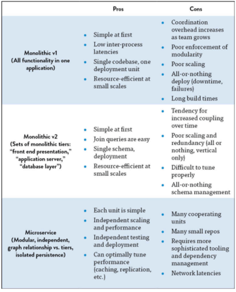
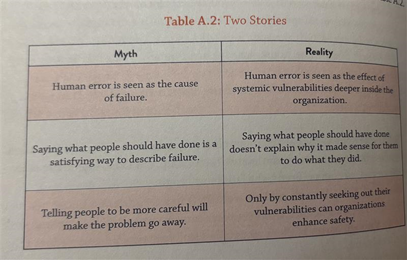

# Dev Ops Concepts
Dev Ops concepts and philosophies from *The DevOps Handbook*

## Index
- [DevOps](#devops)
- [Downward spiral- 3 stages](#downward-spiral--3-stages)
- [Lean Movement](#lean-movement)
- [Agile Manifesto](#agile-manifesto)
- [Continuous delivery movement](#continuous-delivery-movement)
- [Toyota Kata](#toyota-kata)
- [WIP](#wip)
- [Manufacturing/Technology Value Stream](#manufacturingtechnology-value-stream)
- [Lead Time vs Processing Time](#lead-time-vs-processing-time)
- [Percent C/A](#percent-ca)
- [Three Ways](#three-ways)
- [Jargon & Concepts](#jargon--concepts)

## DevOps
-	“Development and Operations”

-	Philosophy and set of practices that combines software development (Dev) and IT operations (Ops) to improve the efficiency, speed, and reliability of software delivery and infrastructure management fostering collaboration and automation

-	“While technology is a piece of a successful transformation into future ways of working, business leadership must take the charge. The bottleneck of today is no longer just technical practices (though they still exist); the biggest challenge and necessity is getting business leadership on board. Transformation must be co-created between the business and technology […] The enterprise can no longer sustain a binary thought process: top down or tech only. We must achieve true collaboration. Ninety percent of that work involves getting the right people engaged, onboard, and aligned. Start there and we can maintain the resulting motivation in to the future” – The DevOps Handbook

## Downward Spiral- 3 Stages
  - Lack of IT operations
    - Complex applications and infrastructure and poor documentation causes systems to be fragile
    - Such technical debt and daily workarounds add up, and are usually what generates revenue for the company
  - Full allocation to satisfy customers
    - Product managers might compensate for issues caused by such technical debt by promising more projects and features
    - Causes developers to work on new features instead of handling debt
  - Development slows down
    - Adding new features becomes more difficult bit by bit- more communication/coordination/approvals become needed for small changes, and everyone’s afraid of making new changes

## Lean Movement
  - Value stream mapping, kanban boards, and total productive maintenance were codified for the Toyota Production System in 1980s
  - Lean Enterprise Institute then applied these concepts to service industry and healthcare…
  - Two central beliefs
    - Manufacturing lead time (time required to convert raw materials into finished goods) is the best predictor of quality, customer satisfaction, and employee happiness
    - One of the best predictors of short lead times is small batch sizes of work

## Agile Manifesto
  - Created in 2001 at an invite-only event by 17 experts in “lightweight methods” in software development 
    - Kent Beck- created Extreme Programming (XP)
    - Ward Cunningham- invented Wiki, co-creator of XP
    - Martin Fowler- expert in software architecture & refactoring
    - Ron Jerrfries- early advocate of XP
    - Robert C. Martin- created SOLID principles, *Clean Code*
    - Steve Mellor- model-driven development, real-time systems
    - Ken Schwaber- co-creator of Scrum
    - Jeff Sutherland- co-creator of Scrum
    - Alistair Cockburn- developed Crystal Methodologies
    - Dave Thomas- co-author of *The Pragmatic Programmer*
    - Jim Highsmith- adaptive software development
    - Jon Kern- agile consultant, aerospace software
    - Arie van Bennekum- contributed to DSDM ("dynamic systems development method")
    - Brian Marick- expert in testing and agile methodologies
    - Adrew Hunt- co-author of *The Pragmatic Programmer*
    - Mike Beedle- worked on Scrum & Enterprise Agile
    - James Grenning- *creator of TDD for Embedded Systems*
  - Objective was to create a set of values and principles that captured the advantage of adaptive methods as opposed to current waterfall development methods

## Continuous Delivery Movement
  - Idea introduced in 2006 during an Agile conference
  - Code and infrastructure should always be in a deployable state, such that all code checked into trunk can safely be deployed to production- there needs to be a deployment pipeline

## Toyota Kata
  - Improvement of kata requires creating structure for daily, habitual practice of improvement of work
  - There needs to be a constant cycle of establishing desired future states, setting target outcomes on cadence, and continual improvement of daily work

## WIP
  - “work in process”
  - We need to minimize WIP (elaborted below in " First Way")

## Manufacturing/Technology Value Stream
  - Manufacturing value stream
    - Sequence of activities required to design, produce, and deliver a good or service to a customer, including the dual flows of information and material
    - The flow for hardware manufacturing is easier to see- materials are released onto the plant floor, batch sizes are made small (WIP is kept small and modular at each stage) to create a smooth flow of work
  - Technology value stream
    - The same concept applies to engineering 
    - An Agile or any other iterative process can organize an idea into a feature specification, and eventually into code in an application or service

## Lead Time vs Processing Time
  -  
  - Both lead time and processing time are used to measure performance in value streams
  - Customers experience lead time- reducing lead time is a function of making communication and engineering workflow smooth

## Percent C/A
  - %C/A
  - “percent complete and accurate”
  - Also measures value stream performance
  - Percentage of work received by a customer that’s ‘usable as is’ (no customer corrections, providing supplement info, no clarifications)

## Three Ways
  - DevOps concept illustrated
  -  
  - There needs to be smaller internal feedback loops to create the smoothest and most efficient technology value stream the last diagram above encapsulates

- **First Way**
    - Working in small batches
    - Work flows from development -> operations- this should be smooth to deliver to customers quickly
    - The priority needs to be “smoother flow” as opposed to local goals like development feature completion rates, test find/fix ratios, or operations availability measures
    - Smaller work batches allow for issues to be found earlier 
    - Reduce WIP 
      - Each engineering team or unit should be doing smaller jobs at a time to avoid constant context switching
      - Context switching is wasted time
    - Making work visible
      - Hardware development and manufacturing tend to be organized into smaller modular pieces since work is expensive and visible 
      - Kanban / sprint planning boards exist to make software tasks visible
    - Reduce handoffs
      - Each time work is passed between teams for testing, integration testing, environment creation, load balancing, etc, information is lost
      - Reducing the number of handoffs by automating processes, reorganizing teams, etc allows for smoother processes
    - Identify and elevate constraints
      - Constraints are items that prevent deployments on demand
      - There needs to be a constant effort to find system constraints
      - “In any value stream, there is always a direction of flow, and there is always one and only constraint; any improvement not made at that constraint is an illusion” – Beyond the Goal by Dr. Goldratt
      - Constraints are found by going down your system:
  - Environment creation
    - Production/test environment creation time must be reduced
  - Code deployment
    - Code deployment must be automated and reduced as an overhead
  - Test setup and run
    - All regression tests must run quickly- parallelize and automate tests 
  - Software architecture
    - There needs to be loose coupling to allow engineers to work modularly and efficiently
  - …after the above is optimized, the constraint will be development or product owners- you want to keep this the constraint at all times
  - We need small teams of developers to independently develop, test, and deploy to customers quickly and reliably
    - Eliminate waste
      - Waste includes:
        - Inventory
          - Aka, partially done work
          - Loses value over time, and becomes obsolete
          - Allocate the work, or get rid of it
        - Overproduction
          - Features not used by the organization or customer (“gold plating”) should be removed
          - Reorganize as a separate task if deemed a needed feature
        - Extra processing
          - If it doesn’t add value to the customer (documentation not used in a downstream work center, reviews / approvals that don’t add value to output), then get rid of it
        - Transportation
          - Aka, context switching
          - Engineers shouldn’t be assigned multiple projects at a time- they should be assigned a sequence of small modular tasks for efficient work
        - Waiting
          - Whatever the wait time is caused by, it should be removed
        - Motion
          - Time and effort spent moving information and materials from one work center to another must be eliminated
        - Defects
          - Incorrect, missing, or unclear information / materials / products create waste
        - Nonstandard or manual work
          - Reliance on nonstandard or manual work from others (non-rebuilding servers, test environments, etc) must be removed
        - Heroics
          - Individuals performing unreasonable acts (nightly 2AM problems in production, etc) must be removed

- **Second Way**
    - Fast feedback and monitoring
    - The objective is to:
      - Detect and remediate problems while they’re smaller, cheaper, and easier to fix
      - Avert problems before they cause a catastrophe
      - Create organizational learning that’s integrated into future work
    - Failures and accidents are opportunities to learn- punishment and blaming is waste
    - Work safely in complex systems
      - Failure is inherent and inevitable in complex systems
      - To avoid catastrophes, four conditions must be met:
  - All work exposed such that design and operations are transparent
  - Problems must be swarmed and solved to quickly construct new knowledge
  - New knowledge must be exploited globally throughout the organization
  - Leaders must create new leaders that grow above capabilities
    - See problems as they occur
      - Constantly test design and operating assumptions
      - Working on a software project for a year, and then testing after delivering the code to a customer (a waterfall project) is horrible
      -  
    - Swarm and solve problems to build new knowledge
      - Upon finding issues, swarm them- mobilize whoever required to solve the issue
      - Don’t let issues become inventory
      - Toyota Andon cord
  - There’s a cord above every work center that every worker and manager must pull when something goes wrong, or something takes longer than documented
  - Team leaders are alerted when the cord is pulled, and the team works to immediately solve the problem
  - If the issue can’t be solved w/in a short specified time (e.g. 55 seconds), then production is halted until the issue is resolved
      - All issues need to be elevated resolved before moving on to:
        - Prevent problems from progressing downstream, where repair costs rise exponentially, and technical debt accumulates 
        - Prevent work centers from starting brand new work, potentially introducing new and compound issues
        - Prevent others from having the same issues, creating waste
          - Emphasize quality close to the source
            - Aka, eliminate distant and manual inspection and approval processes
            - Automate all reviews and inspections wherever possible, and have those close and relevant to do so when needed
            - Don’t generate large volumes of manual documentation that’s quickly outdated
          - Enable optimization for downstream work centers
            - There are external (those paying for products and services being designed) and internal (those receiving and processing work immediately after you) customers
            - Optimize a design and system for those that work after you
            - Includes: architecture, performance, stability, testability, configurability, and security

- **Third Way**
    - Generative culture
    - There needs to be continuous learning and experimentation
    - Individual knowledge must be generated, to then be a part of organizational knowledge
    - The objective is to:
      - Create a high-trust culture and reinforce lifelong learners that take smart risks in daily work
      - Learn from successes and failures, and identify which ideas don’t work and reinforce the solutions that do
      - Rapidly propagate local learning to global learning
    - Enable organizational learning and safety culture
      - “responses to incidents and accidents that are seen as unjust can impede safety investigations, promote fear rather than mindfulness in people who do safety-critical work, make organizations more bureaucratic rather than more careful, and cultivate professional secrecy, evasion, and self-protection”- Dr. Sidney Dekker
      - 3 types of culture
        - Pathological
          - Driven by fear and threat
          - People hoard information for political reasons, or distort it to make themselves look better
          - Failures are hidden
        - Bureaucratic
          - Driven by rules and processes to help individuals maintain their “turf”
          - Failures are processed through a system of judgement, resulting in punishment, or justice and mercy
        - Generative
          - Driven by actively seeking information and sharing information to better enable an organization to achieve its mission
          - Responsibilities are shared throughout the value stream, and failure results in reflection and genuine inquiry
          - Institutionalize daily work improvement
            - When individuals and teams don’t experiment to change and improve processes, engineers suffer from current problems and get worse over time- chaos and entropy causes processes to degrade over time
            - Time needs to be allocated to pay down technical debt, fix defects, and refactor cycles in each development cycle
          - Transform local discoveries into global improvements
            - All blameless post-mortem reports should be searchable by teams trying to solve similar problems
            - There needs to be shared code repositories spanning across the entire organization where code, libraries, and configurations that embody the best collective knowledge of the entire organization can easily be utilized
          - Inject resilience patterns into daily work
            - Prioritize experimentation to add capacity instead of buying new equipment or hiring more people
            - A continuous state of tension from anticipated changes creates “antifragility” and increased resilience 
          - Leaders must reinforce a learning culture
            - Leaders must create conditions to let teams discover greatness in their daily work
            - Leaders should elevate the value of learning and disciplined problem-solving

## Jargon & Concepts
  - Greenfield vs Brownfield
    - Fresh grass is easier to architect and build on than polluted unstable ground
    - Transforming a brownfield project is significantly harder than generating a clean greenfield project, but it’s possible w/ the right steps and outlooks
  - Conway’s law
    - “Any organization that designs a system will produce a design whose structure is a copy of the organization's communication structure.” – Melvin Conway, 1967
    - There needs to be proper organization at the highest team management level for an organization to generate proper and modular systems
  - Organizational archetypes 
    - Functional-oriented
      - Optimize for expertise, division of labor, or cost
      - Centralize expertise, and tend to have tall hierarchical organizational structures
      - Creates creativity and motivation vacuums
    - Matrix-oriented
      - Attempt to combine functional and market orientation
      - Result in complex organizational structures, where engineers report to multiple managers, sometimes achieving neither functional or market orientation goals
    - Market-oriented
      - Optimized for responding quickly to customer needs
      - Flat- tend to be composed of multiple cross-disciplines (marketing, engineering, etc), which often lead to redundancies across organization
      - This is how prominent organizations adopting DevOps operate
    -  
  - Generalist vs specialist
    - Those that are familiar w/ the full application stack are called generalists- now called “full-stack engineers”
    -  
    - An organization full of specialists operate like sovereign states
  - Two-pizza team rule
    - A team should only be as small as can be fed w/ two pizzas (5-10 people)
    - Pros include:
      - Team has a clear, shared understanding of the system
      - Limits growth rate of product or service being worked on (to allow organization to maintain a shared understanding)
      - Decentralizes power and enables autonomy
      - Allows for employees to gain some leadership experience
  - Scrum methodology
    - Scrum is an Agile framework used to develop, deliver, and sustain complex products
    - Emphasizes collaboration, iterative progress, and adaptive planning
    - Sprint
      - Time-boxed iteration (1-4 weeks) during which a set of backlog items is completed and made potentially shippable
  - Blitz
    - Informal lingo for “a short, intense burst of work (coding, hackathon, or feature push) typically outside of normal process or cadence”
    - …last minute push to meet a deadline
    - デスマーチ
  - Automated test categories
    - Unit tests
      - Tests for isolated method/class/function to ensure code behavior
    - Acceptance tests
      - Tests an application as a whole 
      - Proving that a system works as the customer requested it to
    - Integration tests
      - Tests to ensure that application correctly interacts w/ other production applications and services 
      - Integration tests should be minimized, to find issues during unit testing and acceptance testing
  - Deployment pipeline requirements
    - Deploying the same way to every environment
      - Will be much more successful when the same deployment process is executed at the development, test, and production level
    - Smoke testing deployments
      - There must be tests to verify connection to all supporting systems (databases, message buses, external services)
    - Ensure consistent environments are maintained
      - Ensure that all environments (development, test, and production) are synchronized
  - Code promotion without manual steps or handoffs
    - Build
      - Deployment pipeline must create packages from version control that can be deployed to any environment, including production
    - Test
      - Anyone should be able to run one or all automated test suites on their workstation or on test systems
    - Deploy
      - Anybody should be able to deploy generated packages to any environment where they have access, executed by running scripts that are also checked into version control
  - Deployment vs release
    - Deploy
      - Installation of specified version of software to a given environment
      - May or may not be associated w/ a particular release for a customer
    - Release
      - When a particular feature or set of features is made available to all customers or a segment of customers
      - Release of functionality should not require changing application code
  - Release patterns
    - Environment-based
      - Where there are two or more environments where applications are deployed to, but only one environment is receiving customer traffic
      - Powerful- require little or no change to applications
      - Includes:
  - Blue-green deployments
    -  
    - Two production environments- only one is ever serving customer traffic
    - Testing is done on the inactive environment, and when done that environment switches to serving customer traffic
    - Rollbacks can be done by switching back environments
  - Canary releases
    -  
    - Named from coal miners using canaries to detect carbon monoxide early
    - Refers to slowly introducing a feature / environment to a set of traffic before releasing it to an entire customer base
  - Cluster immune systems
    - Expands the canary release pattern by linking production monitoring system w/ release process by automating rollback of code when user-facing performance of production system deviates outside of a predefined expected range
    - Application-based
      - Modifying applications so that an organization can selectively release and expose specific application functionality by small configuration changes
      - Ex: implementing feature flags that progressively exposes new functionality in production to the development team, all internal employees, 1% of customers, or (when there’s confidence that a release will operate as desired) an entire customer base
      - Enables dark launching- stage all functionality to be launched in production, and test w/ production traffic before release
  - A/B testing
    - Comparing two versions of something, and providing each to a split environment to observe differences in performance
  - Monolith vs Microservice
    - Both are architectural archetypes
    - Monoliths help achieve product/market fit at first at the cost of risking organizational failure upon scaling
      - Ebay in 2001, Amazon in 2001, Twitter in 2009, LinkedIn in 2011
    -  
  - Telemetry
    - Aka metrics
    - There are numerous ways to detect failures and measure application and system successes…
  - Hypothesis driven development
    - “practice of making product or feature decisions based on a specific hypothesis, testing it, and using the results to guide what gets built, changed, or discarded”
    - Allows for evidence-based development to minimize unvalidated features
  - Code review guidelines
    - Everyone must have someone review changes before committing to trunk
    - Everyone should monitor commit stream of fellow team members to potential conflicts can be identified and reviewed
    - Changes identified as high risk should be designated review from a subject matter expert 
    - If someone submits a change that’s too large to reason easily (ie, if you need to ask for clarification), then it needs to be split up into multiple smaller changes to be understood at a glance
  - Pair programming
    - Two engineers working together at the same workstation, to divide “driver” role and “navigator/observer/pointer” role
    - Coined by Extreme Programming and Agile in early 2000s
    - Allows one to focus on technical aspects, and the other to serve as a safety net
    - Reinforces TDD, if one engineer focuses on automated tests, and the other engineer implements the code
    - Allows for spread of knowledge
  - Create a single, shared source code repository for entire organization
    - Integrating local discoveries across an entire organization is done best by having a single shared repo
    - Includes:
      - Source code
      - Configuration standards for libraries, infrastructure, and environments (Chef, Puppet, Ansible scripts)
      - Deployment tools
      - Testing standards and tools, including security
      - Deployment pipeline tools
      - Monitoring and analysis tools 
      - Tutorials and standards
  - Security
    - Effective QA, infosec, and fraud practitioners will focus on “sad paths” through a particular application to highlight security-related error conditions
    - Static analysis
      - Testing performed in non-runtime environment, ideally in the deployment pipeline
      - finds all runtime behaviors to find coding flaws, back doors, malicious code
    - Dynamic analysis
      - Testing done while the code is executing
      - Monitors system memory, functional behavior, response time, and overall performance of the system
    - Dependency scanning
      - Static testing performed in a deployment pipeline to verify that binaries and executables generated are free of vulnerabilities and malicious content
    - Source code integrity and code signing
      - All devs should have a PGP (“pretty good privacy”) key to sign all commits on a version control system
      - Allows for data encryption and verification of software packages
    - Categories of source code changes:
      - Standard changes
        - Lower-risk changes that follow an established and approved process
        - Potentially pre-approved
        - No approval required for deployment- entire process may be automated
      - Normal changes
        - Higher-risk changes that require review or approval from authority
        - May be checked by CAB (“change advisory board”) or ECAB (“emergency CAB”), lacking expertise
        - Leads to long lead times
      - Urgent changes
        - Emergency / high-risk changes that must be put into production immediately
        - Requires senior management approval
  - Myths of industrial safety
    - Human error is the largest single cause of accidents and incidents
    - Systems will be safe if people comply with the procedures they have been given
    - Safety can be improved by barriers and protection; more layers of protection results in higher safety
    - Accident analysis can identify the root cause (the ‘truth’) of why the accident happened
    - Accident investigation is the logical and rational identification of causes based on facts
    - Safety always has the highest priority and will never be compromised
    -  

- CI/CD 
  - (“continuous integration/continuous deployment”)
  - “continuous integration”
    - Continuously integrating changes from multiple users into a shared repository 
    - Every integration checked via automated build system to detect errors quickly and early
  - “continuous deployment/delivery”
    - Automatically updating production/release codebase after every new integration that passes all production pipeline stages
    - “Continuous delivery” is when the final deployment step requires some manual approval
  - CI/CD pipelines
  - A pipeline for software development is a path of building, testing, and deploying software- automating this process minimizes human error and establishes a uniform process to verify software before it’s released

- Gradle
  - Build automation tool for Java and Android projects
  - Used to compile code, run tests, package applications, resolve dependencies, etc

- Groovy
    - Language used by Gradle to write build scripts
    - “Optionally typed” programming language
      - You can be either explicit or omit data types when declaring new variables and functions
    - Also used by Jenkins for build automation to customize pipeline configuration and workflow

- Ansible
  - Automation tool for configuration management, application deployment, and task automation
  - Used to manage servers / deploy applications via YAML scripts and “playbooks”
  - “agentless”- no software installation needed- uses SSH for Linux / Windows PowerShell to execute tasks
  - This is the tool that allows servers to automatically run various tools to build, test, and deploy projects via servers

- Terraform
  - Similar to Ansible, alleviates user management of build servers by taking config files to define the infrastructure of servers
  - Mainly used to configure / set up servers as opposed to Ansible which deploys build artifacts and runs applications on servers
  - By Hashicorp- same company that created Packer

- Conan
  - No, not detective conan
  - Package manager used to manage C/C++ project dependencies and libraries
  - Automates finding, building, installing libraries 
  - Allows easy sharing/reusing of code, version management, and configuration management
  - Integrates well w/ CMake 
  - Can be used as a high level tool to invoke other tools, as opposed to CMake w/ limited set of tool invoking capabilities

- Nexus
  - Repository manager to centralize repositories across different platforms and environments 
  - Allows artifact versioning
  - Integrates well w/ CI/CD tools like Jenkins and GitLab CI
  - Supports managing Docker images as well

- Jenkins
  - Open-source automation server to facilitate CI/CD
  - Automates software development cycle including building, testing, deploying applications
  - Allows developers to integrate code frequently and detect issues early
  - Increases development speed and fortifies software releases
  - Features
    - Build automation
    - Test automation
      - Unit testing 
  - individual components (code)
      - Integration testing 
  - testing interactions between components
      - System testing 
  - testing system as a whole
      - Acceptance testing 
  - testing that software meets user requirements
    - Deployment automation
      - Delivering and installing software to a production environment for end-users to use
      - Configuration 
  - setting up environment including server connections and database connections for software to run on 
      - Installation
  - deploying software artifacts to target environment; copying files and running installation scripts)
      - Verification
  - checking that software functions properly in production environment)
      - Monitoring 
  - Tracking performance and behavior of software in production 
    - Pipeline support (steps to building/testing complex software)
    - Easy config
    - Implements monitoring (dashboards, reports, logs)
  - .jelly files
    - Used to define UI for Jenkins web interface
  - Groovy and Jenkinsfiles
    - Groovy
      - Dynamic, JVM-based scripting language used in Jenkins pipeline scripts
    - Jenkinsfile
      - What define Jenkins pipelines
      - Written in a DSL (“domain-specific language”) built on top of Groovy
      - It’s a sandboxed language for security- 
  - Only whitelisted methods and classes can be used
  - Arbitrary Groovy code execution is restricted unless explicitly approved by an administrator
  - Agents
    - Node that Jenkins uses to execute jobs- runs and builds tasks under the control of the Jenkins controller
      - Used to be called slave and master respectively
    - Jenkins can spin up agents on demand w/ Kubernetes, AWS, or Docker
    - Types of agents
      - Static agent
  - Manually configured
  - Always available
      - Dynamic agent
  - Created on-demand (cloud-based)
      - Cloud agent
  - Runs in cloud environments like AWS, Kubernetes, Docker
      - Container agent
  - Runs inside a Docker container for isolation

- DevOps hierarchy 
  - Jenkins hosts a server to run CI/CI pipelines 
    - Terraform used to configure and set up the server
    - Projects on GitLab are built to generate build artifacts
    - Build artifacts are stored on Nexus
    - Binaries are loaded from Nexus to hardware and tested via Ansible scripts that run batch scripts

- Azure
  - Cloud computing platform by Microsoft
  - Allows deployment of VMs, w/ support for SQL and other services

- Unit testing
  - Unit testing for C
    - Unity
      - Lightweight, portable unit testing framework for C
      - Good for embedded systems development
      - Used to write and manage test cases for verifying functions/modules in C
    - CMock
      - Tool to generate mock functions and header files
  - Unit testing for C++
    - gTest + gMock
      - by Google
      - gMock is a library to create mock objects in C++
      - gTest is a framework for writing/running unit tests
  - both C/C++
    - CppUTest
      - Lightweight C++ unit testing framework for embedded systems
    - CppUMock
      - Mocking extension for CppUTest for simulating behavior for dependencies during tests
  - Bazel
    - Open source build/test tool developed by Google
    - To be used w/ Java, C++, Python projects
  - STL
    - “standard template library”
    - Fundamental C++ library 
    - Provides data structures like vectors, maps, sorting algos, iterators for containers, etc
  - Boost
    - Collection of C++ libraries extending functionality of STL
    - Includes ASIO library for low level embedded network/serial interfacing
    - Includes a unit testing framework to perform regression tests
      - Regression testing
  - Process of re-running existing tests to ensure new changes haven’t broken existing functionality 
