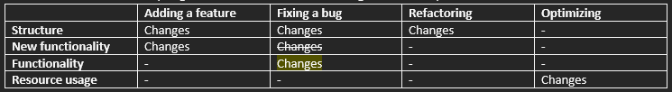

# Legacy Code Concepts
Key concepts when dealing w/ legacy code. 

Includes major concepts mentioned in *Working Effectively with Legacy Code*, but this tldr document doesn't exhuast all major concepts mentioned in the book.

## Index
- [What's Legacy Code?](#whats-legacy-code)
- [Four Reasons to Change Software](#four-reasons-to-change-software)
- [Two Approaches to Software Development](#two-approaches-to-software-development)
- [Software Vise](#software-vise)
- [Error Localization](#error-localization)
- [High Level Tests](#high-level-tests)
- [Legacy Code Dilemma](#legacy-code-dilemma)
- [Sensing, Separation, and Seams](#sensing-separation-and-seams)
- [Command/Query Separation](#commandquery-separation)
- [Characterization Tests](#characterization-tests)
- [Sensing Variables](#sensing-variables)
- [Encountering Bugs](#encountering-bugs)
- [Effect Propagation](#effect-propagation)
- [Scratch Refactoring](#scratch-refactoring)
- [Naming Tests](#naming-tests)
- [Test Location](#test-location)
- [Breaking Apart a Huge Class](#breaking-apart-a-huge-class)
- [All Languages](#all-languages)
- [OOP Language Specific](#oop-language-specific)
- [Procedural Language Specific](#procedural-language-specific)

## What's Legacy Code?
-	“Sometimes we blame our customers. Sometimes we accuse them of changing the requirements. We comfort ourselves with the belief that if the customers had just been happy with what they said they needed, the design would have been fine. It’s the customer’s fault for changing the requirements on us. Well, here’s a news flash: Requirements change. Desings that cannot tolerate changing requirements are poor designs to begin with. It is the goal of every competent software developer to create designs that tolerate change. This seems to be an intractably hard problem to solve. So hard, in fact, that nearly every system every produced suffers from slow, debilitating rot. The rot is so pervasive that we’ve come up with a special name for rotten programs. We call them: Legacy Code.” – Robert C. Martin in *Working Effectively with Legacy Code*

-	“Code without tests is bad code. It doesn’t matter how well written it is; it doesn’t matter how pretty or object-oriented or well-encapsulated it is. With tests, we can change the behavior of our code quickly and verifiably. Without them, we really don’t know if our code is getting better or worse.” – Michael C. Feathers

## Four Reasons to Change Software
  - **Adding a feature**
    - Adding a feature changes a program’s “behavior”
    - Behavior is the most important thing about software- users like it when we add behavior, and they stop trusting us when behavior is changed or removed
  - **Fixing a bug**
    - Bugs arise from adding features without verifying behavior
  - **Improving the design**
    - This is to add maintainability without losing behavior
    - If you lose behavior while improving design, it’s called a bug
    - Improving design without changing its behavior is called “refactoring”
    - ***Refactoring***
      - “A change made to the internal structure of software to make it easier to understand and cheaper to modify without changing its existing behavior” – Martin Fowler
  - **Optimizing resource usage**
    - This is to change the program’s resource usage (time, memory, etc) without losing behavior

  - We need to isolate original program behavior changes from feature additions to work on one thing at a time- whether it’s bug fixing, adding new features, or adding tests to confirm original program behavior

## Two Approaches to Software Development
  - Edit and pray
    - We all edit and pray- we poke around after writing code, sometimes we don’t
    - This poking around is “testing to attempt to show correctness”
    - We have variable confidence in whether something truly works
  - Cover and modify
    - When a codebase isn’t written w/ test driven development to begin w/, we need to first cover, and then modify
    - This means covering the relevant code with tests, and confidently adding in your new changes
    - These tests are “tests that detect change”

## Software Vise
  - Tests that hold software’s behavior in place is called a software vise, just as a regular vise would clamp an object while you perform some operation on the object

## Error Localization
  - It gets harder to determine what each test means when they’re farther away from the source
  - When tests are small, you can pinpoint the pinch of code that cause every failure

## High Level Tests
  - High level unit tests are still helpful- they help you pin down the behavior of larger entities, to then write smaller tests
  - It’s a first step to getting unit tests in place

## Legacy Code Dilemma
  - When we change code, we should have tests in place, but to put tests in place, we often have to change code
  - There’s no way around changing code, but we can carefully pick and choose what changes to make to minimize program behavior changes to then inject tests 
  - The algorithm is:
    - Identify change points
    - Find test points
    - Write tests
    - Make changes and refactor 
  - Long story short:
    - all new features must be written w/ test driven development
    - unit tests must be written to verify that the legacy code does what it originally did whenever changes are made
    - if unit tests can’t be injected into the legacy code, then a refactoring method must be chosen accordingly to modify the code so that unit tests can be written

## Sensing, Separation, and Seams
  - Sensing
    - Break dependencies to “sense” when unit tests can’t get to values that code computes
  - Separation
    - Break dependencies to “separate” if code can’t even get into a test harness to run 
    - Ie, if there are too many dependencies for a particular function to get into a test harness, tear the code apart
  - Seams
    - Legacy code isn’t suited for testing- usually you’re working w/ spaghetti code full of dependencies left and right
    - A seam is a place where you can alter behavior of a program without editing in that place
    - Seams allow users to selectively remove dependencies from a function, so the function can get into a unit test to verify all other behavior
    - Enabling point
      - Every seam has an enabling point, where you can make the decision to use one behavior or another
    - Types of seams
      - **Preprocessing seam**
        - You can use the preprocessor to replace a dependency w/ a fake or mock for testing purposes
      - **Link seam**
        - A fake or mock can be injected in place of a nasty function or class by writing a function or class w/ the same signature in a separate file, and by choosing different implementations at link time
      - **Object seam**
        - The most useful seams available for OOP
        - Elaborated below

## Command/Query Separation
  - A method should be a command or a query, but not both
    - A command is a method that can modify the state of the object but doesn’t return a value
    - A query is a method that returns a value but doesn’t modify the object
  - Aka, single responsibility principle
  - Eliminates headaches from side effects when testing code

## Characterization Tests
  - Aka, targeted tests
  - You can start an effort to write tests for a piece of software by writing characterization tests
  - A characterization test is a test that characterizes the actual behavior of the code
    - “There’s no ‘Well, it should do this’ or ‘I think it does that.’ The tests document the actual behavior current behavior of the system.”
  - The algo can be:
    - Use a piece of code in a test harness
    - Write an assertion that you know will fail
    - Let the failure tell you what the behavior is
    - Change the test so that it expects the behavior that the code produces
    - Repeat
  - Heuristic to write characterization tests
    - Write tests for area where you’ll make changes (as many cases as you feel you need to understand the behavior of the code)
    - Look at specific things you’re going to change, and attempt to write tests for them
    - If you’re attempting to extract or move out functionality, write tests that verify the existence and connection of those behaviors on a case-by-case basis

## Sensing Variables
  - New variables can be injected to refactor a long method to sense

## Encountering Bugs
  - Legacy code has bugs in direct proportion to how little is understood by everyone
  - If the system hasn’t been deployed yet, you can go ahead and fix the bug
  - If it has been deployed, the possibility that someone is depending on the behavior needs to be considered- escalate the issue to figure out what’s to be done as a team

## Effect Propagation
  - When making changes to a piece of code, you need to consider the propagated effects
  - Effects propagate in 3 basic ways:
    - Return values used by a caller
    - Modification of objects passed as parameters that are used later
    - Modifications of static or global data that is used later
  - Heuristics for when looking for effects:
    - Identify method to change
    - If method has a return value, look at its callers
    - Check if method modifies any values- if it does, look at methods that use those values, and methods that use those methods
    - Make sure to look for superclasses and subclasses that might be users of these instance variables and methods too
    - Look at parameters to the methods- check if they or any object that their methods return are used by the code to be changed
    - Look for global variables and static data that’s modified in any way of the methods identified
  - Interception point
    - A point in a program where you can detect the effects of a particular change
  - Pinch point
    - A narrowing in an effect sketch, where it’s possible to write tests to cover a wide set of changes
    - Tests against a couple of methods 
  - Effect sketch
    - Great for reasoning forward from a point of change
  - Feature sketch
    - Great for mapping the internal structure of a class

## Scratch Refactoring
  - You can learn about the codebase by decoupling code from a version control system and starting a free-for-all session
  - Moving things around, refactoring, and then throwing it away can reveal information about how something works

## Naming Tests
  - In a file full of tests, it helps when you add “Test” as a suffix to sort all tests alphabetically
  - When a mock or fake is in a pool of source code, adding “fake” as the prefix helps identify the fakes

## Test Location
  - Tests can be in their own directory under the same top level directory that the source code is in reflecting the directory structure of the source code, 
  - Tests can also be placed directly with each source file, as long as file names are carefully picked to distinguish between files and the build system can pick and choose files

## Breaking Apart a Huge Class
  - 7 heuristics:
    - Group methods
      - Find similar method names that seem like they should be a class of their own
    - Look at hidden methods
      - If a class has a whole lot of private and protected methods, it’s an indicator that there’s a class waiting to be refactored out
    - Look for decisions that can change
      - Look at decisions that were already made, and identify things that appear to be hardcoded
    - Look for internal relationships
      - Check for whether certain instance variables are used by some methods and not others
    - Look for primary responsibility
      - A class should describe its role in a single sentence
    - When all else fails, do some scratch refactoring
      - Just try moving things around if it’s too much of a mess
    - Focus on the current work
      - Pay attention to the work that needs to be done- if a class is providing an alternative way of doing something that’s already being done, then it should be extracted and substituted 
  - Skeletonize vs find sequences
    - Each time you encounter a conditional statement and its associated compound statement, you have 2 choices:
      - Extract condition and body together
      - Extract condition and body separately
    - Both are valid, depending on the frequency of the condition, body, and the condition and body together

## All Languages
  - Sprout method
    - If a new feature can be encapsulated into a function, then great- write the new function w/ TDD 
    - This way at least the new code you’re introducing is fully covered
    - This method applies for new features, and any changes to a set of code too (if you can encapsulate the code into a function, and then write tests for that function, we’re in business)
    - Steps:
      - Identify where you need to make code change
      - If the change can be formulated as a single sequence of statements in one place- inject your new method that will do that work and comment out the statements
      - Determine local variables that are needed from the source scope and pass them to the function as arguments
      - Develop the sprout method w/ test driven development
      - Remove the comment in source 
    - Pros
      - Nice separation of old code vs new code
      - New code confidently works
    - Cons
      - You’re giving up on the original scope where the new function is injected (at least for now)
  - Wrap method
    - If a function needs to be modified with a feature before or after the rest of its guts, then you can apply the wrap method
    - The wrap method is where you: rename old function -> write empty new function w/ old function signature -> call old function in new function -> inject new feature in new function as another function (written w/ TDD)
    - Steps:
      - Identify function to change
      - Rename function and create new function w/ the same name and signature as the old function
      - Place call to old function in new function
      - Write function for new feature w/ TDD and call it from new function
    - Pros
      - Doesn’t increase size of existing function
      - New feature is isolated from existing code
    - Cons
      - Doesn’t work when new feature needs to be intertwined w/ the rest of the code that the function is in
      - You need to come up w/ a new name for the old function- leads to poor names
  - Reducing time taken to make changes
    - Systems need to be broken up into small, well-named, understandable pieces to enable faster work
    - Lag time (time passed between a change made and getting feedback about the change) needs to be reduced- every module in a system needs to be able to be built separately, and tested in a test harness
    - Dependencies must be broken
  - Test code vs production code
    - Test code doesn’t have to live up to standards of production code
    - Encapsulation can be broken, and functions can be made public if need be, but test code should be clean, easy to understand, and change

## OOP Language Specific
  - Faking collaborators
    - Fake objects 
      - An object that’s in the way of a function to get into a unit test can be replaced by a fake object instead- the fake object can replicate the original object, but have its guts removed of all further dependencies
    - Mocks
      - If an object is being faked everywhere, the object should be mocked instead
      - A mock is a fake that performs assertions internally- it can expect function calls, and check whether it received said function calls
  - Tools
    - Sometimes, IDE’s come w/ refactoring tools… the issue is that many tools don’t verify whether a change modified behavior
    - The best way to refactor w/ confidence is by adding in handwritten unit tests, and then making changes
    - Half-baked shortcuts just introduce more bugs
  - Sprout class
    - If changes need to be made to a class, but the class is full of gunk and is impossible to put into a test harness, then a sprout class can be written
    - The sprout class can have just the particular methods or features that need to be implemented- by then writing an interface class that’s inherited by the sprout class and the gunk class, you can swap out the gunk class for the sprout class
  - Wrap class
    - Same concept as sprout class, but applied to wrap method
    - Aka, the “decorator pattern”
      - When objects of a class wrap another class, and is passed around
      - By having the wrap class inherit the same interface that the original class does, users won’t know that they’re working w/ the wrap class
  - Programming by difference
    - Using inheritance to add features without modifying a class directly
  - Getting a class in a test harness
    - 4 reasons why a class wouldn’t be able to get into a test harness
      - Objects of the class can’t be created easily
      - Test harness won’t easily build w/ the class in it
      - Constructor needed has bad side effects
      - Significant work is done in the constructor, and it needs to be sensed
    - Extract interface
      - One of the safest dependency-breaking techniques
      - By creating an interface w/ all the methods you want to use in some context, you can implement the interface to sense or separate, and pass fake objects into the class you want to test
      - 3 ways of applying extract interface
        - Automated refactoring tools
        - Extract it incrementally
        - Cut/copy and paste several methods from a class at once and place their declarations in an interface
      - Extract implementer
        - The issue w/ extract interface is that you need to write a new name for the existing class
        - Extract implementer is a way of migrating the contents of a class into a copy of the class but w/ a “production” extension instead...
      - Adapt parameter
        - If a parameter is already a dependency, an interface can be created to be used in the method, and the interface can be subclassed to switch between the production code that uses the parameter and the test code that doesn’t
    - Pass null
      - If an object requires a parameter that’s hard to construct, you could pass null instead- an exception will be thrown if the parameter is used, and can be caught by the test harness
      - This will help determine whether you need to care about the parameter
      - Doesn’t work for C++ since tests can crash in response to working on null pointers
    - Expose static method
      - If a class is difficult to put in a test harness, you can expose static methods first- when the methods are public, they can be tested
    - Preserve signatures
      - Refactoring and adding new seams is error prone
      - Errors can be reduced if you copy over entire function signatures whenever possible
    - Break out method object
      - If a class has a long method that’s difficult to work w/, operations done in the method can be migrated into its own class
      - The new class can be tested
    - Hidden dependency 
      - A constructor could rely on a hidden resource
      - Parameterize constructor
        - By extracting the resource and adding a new argument to the constructor, you can apply dependency injection to create a seam 
        - The original constructor can still exist, and you can call the new constructor in the old constructor
      - Parameterize method
        - If a method internally generates a method, create a copy of the method that takes in an object as a parameter and performs an assignment instead
        - This generates a new seam
      - Extract and override factory method
        - If there are too many dependencies to pass to a constructor, all those dependencies can be extracted to a method under a new class, subclass the class, and override it w/ a fake as needed
      - Supersede instance variable
        - For languages that don’t allow overrides of virtual function calls in constructors, extract and override factory method doesn’t work
        - You can write a method that deletes the instance variable that’s in the way of any sensing as needed, and replaces it w/ a fake
      - Extract and override call
        - If there’s a dependency on a class instance’s function call that’s a global variable, you can extract the call into a subclass of a testing class- you can then override it w/ a mock or fake
      - Subclass and override
        - Core technique to override dependencies in OOP- most other methods are variations of this method
        - The concept is to override a set of methods you want to break away from by creating a subclass of the problematic class
      - Singleton design pattern
        - A pattern used by people to make sure that there can only be one instance of a particular class in a program
        - Characteristics include:	
          - Constructors of a singleton class are usually private
          - Static member of the class holds the only instance of the class ever created in the program
          - Static method is used to access the instance, and is usually called “instance” or “getinstance”
        - Often used to create global variables
        - Prevents people from making more than one instance of a class in a test harness
        - Introduce static setter
          - A singleton can be replaced by adding a setter method to the class, and then reducing the singleton constructor to protected to allow subclassing the singleton for fresh object creation
      - Encapsulate global references
        - When there are problematic dependencies, you have 3 choices:
          - Try to make globals act differently during test
          - Link to different globals
          - Encapsulate globals to further decouple things
        - You can write a new class that wraps the global variables, and then instantiate the new global 
        - The class serves as a new seam to inject fakes, by applying “introduct static setter”, “parameterize constructor”, “parameterize method”, “replace global references w/ getter”
      - Replace global reference w/ getter
        - Global variable accesses can be overridden by writing a getter method for every global 
        - The getters can be overridden by subclassing the class
      - Lean on the compiler
        - When replacing a global w/ whatever new method you’re using to introduce a seam to inject fakes, you can remove the global variable declaration and let the compiler tell you every single place where the global is used
      - When there’s heavy reliance on an API, there are 2 approaches:
        - Skin and wrap the API
          - When code is heavily reliant on API calls, you can write a wrapper around the API- the wrapper introduces a seam to inject mocks and fakes
          - Good for:
            - Small API
            - Completely separate dependencies on a 3rd party library
        - Responsibility-based extraction
          - Identify responsibilities in code and start extracting methods for them
          - Good for:
            - Complicated APIs
            - There’s a tool that provides safe extract method support, or you’re confident that you can do the extractions safely by hand
      - Gleaning dependencies
        - If there’s a monster method that can’t be placed in a test harness, then write tests for the behavior that’s critical, and then extract the items that test can’t be written for
        - This way, there’s at least some tests for crucial behavior

## Procedural Language Specific
  - Horrible include dependencies
    - It sucks when there are include directives left and right, but they’re all seams to introduce mocks and fakes
    - Use the seams to introduce new implementation definitions  
  - As you can see, there’s a small list of things you can do to introduce unit tests into procedural code
    - Link and preprocessor seams are our friends
    - By using the linker or preprocessor, we can inject fakes and mocks
