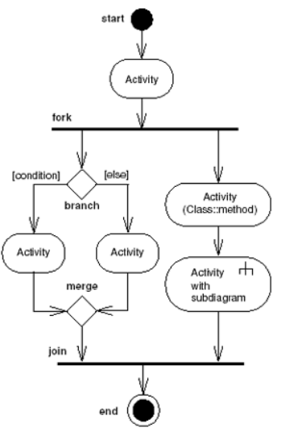
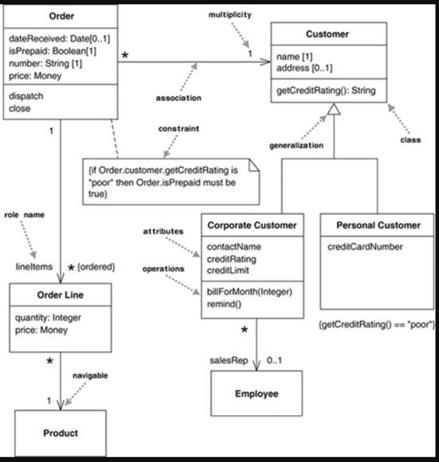
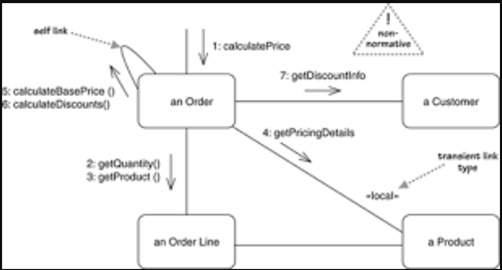
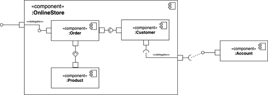
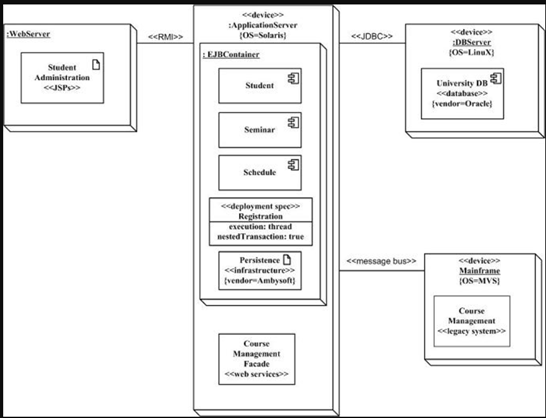
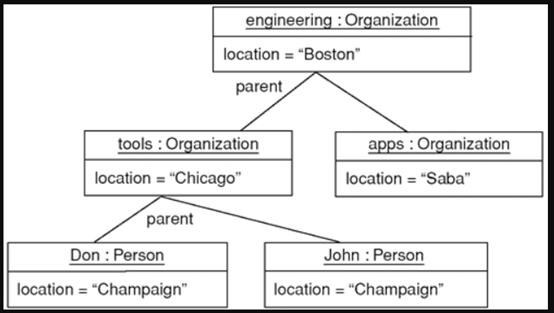
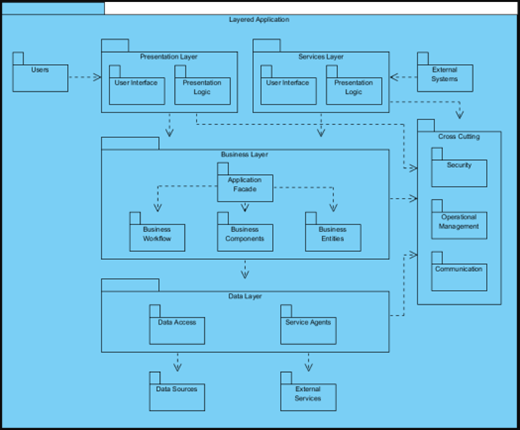
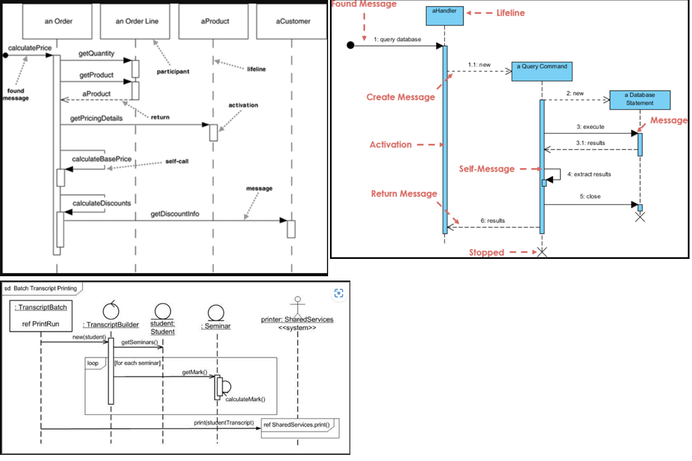
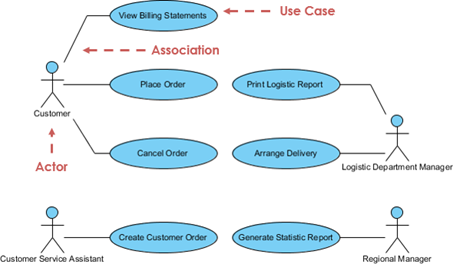

# UML Guide
Key UML diagram categories and concepts from *UML Distilled*

## Index
- [UML](#uml)
- [Uses of UML](#uses-of-uml)
- [Development Processes]()
- [UML Jargon](#uml-jargon)
- [Types of UML Diagrams](#types-of-uml-diagrams)
- [Activity Diagram](#activity-diagram)
- [Class Diagram](#class-diagram)
- [Communication Diagram](#communication-diagram)
- [Component Diagram](#component-diagram)
- [Composite Structure Diagram](#composite-structure-diagram)
- [Deployment Diagram](#deployment-diagram)
- [Interaction Overview Diagram](#interaction-overview-diagram)
- [Object Ddiagram](#object-ddiagram)
- [Package Diagram](#package-diagram)
- [Sequence Diagram](#sequence-diagram)
- [State Machine diagram](#state-machine-diagram)
- [Timing Diagram](#timing-diagram)
- [Use Case Diagram](#use-case-diagram)

## UML
  -	UML is “a family of graphical notations, backed by single meta-model, that help in describing and designing software systems, particularly software systems built using the object-oriented style” – Martin Fowler in UML Distilled
    - Notation
      - Graphical syntax of the modeling language
      - Aka, the nitty gritty
    - Meta-model
      - A diagram (usually a class diagram) that define the concepts of a language

  -	“Question: What is the difference between a methodologist and a terrorist? Answer: You can negotiate with a terrorist” – Martin Fowler in UML Distilled
  
  - The biggest risk w/ using UML in analysis is when there are diagrams that domain experts don’t understand- the diagrams are worse than useless. They breed a false sense of confidence in the development team

  -	UML and adhering to strict rules
    - Prescriptive rules
      - A language w/ prescriptive rules is controlled by an official body that states what is or isn’t legal in the language and what meaning you give to utterances in that language
      - Aka, programming languages
    - Descriptive rules
      - A language w/ descriptive rules is one which you understand its rules by looking at how people use the language in practice 
      - English, etc
    - UML is a mix of both- the objective is to communicate and establish a common understanding- not to be caught up and slowed by semantics

## Uses of UML
  - UML as a sketch
    - When developers use UML to communicate some aspects of a system
    - Informal and dynamic- to be done quickly and collaboratively to talk about just the items worth talking about
    - Forward engineering
      - Drawing UML diagrams before coding
      - Objective is to discuss ideas, alternatives, and potential issues
      - Short 10 min sessions to talk w/ colleagues w/ UML visuals as an aid
    - Reverse engineering
      - Drawing UML diagrams after coding (to better understand existing code)
      - Using UML as an aid to talk about a part of a system
  - UML as a blueprint
    - A detailed design for engineers to use to code up
    - Issues w/ using UML as a blueprint:
      - Fine details tie a diagram to a particular language and application
      - w/ too many details, it becomes a hassle to change the diagram in response to each software design change
      - the value of an abstract visual diminishes when a diagram is daunting to look at (pages and pages of diagrams)
    - To thoroughly describe an entire system w/ UML, a user might use CASE (“computer-aided software engineering”) tools to store and generate UML diagrams
    - Round-trip tools
      - CASE tools that can be used for both forward engineering (allow engineers to create and store UML diagrams on their own) and reverse engineering (generate UML diagrams from existing source code)
  - UML as a programming language
    - Aka, MDA
    - When a CASE tool can generate source code

## Development Processes
  - RUP
    - “rational unified process”
    - A process framework that can be used w/ UML
    - An iterative process consisting of four phases:
      - Inception
        - Initial evaluation of a project
      - Elaboration
        - Identifies primary use cases of project and builds software in iterations to shake out the architecture of the system
      - Construction
        - Continuing the building process
        - Develop to release
      - Transition
        - Late-stage activities that aren’t done iteratively- deployment into a data center, user training, etc
  - Iterative development
    - Breaking down a project by subsets of functionality
    - Small cycles of analysis, design, coding, and testing, as opposed to isolating each category of engineering into their own blocks of time
  - Waterfall development
    - Breaking down a project based on activity
    - Long sessions of analysis, design, coding, and testing
  - Adaptive planning
    - Planning on the assumption that requirements change- treating change as a constant in a software project
    - Assumes that users will collaborate w/ the development team to regularly reassess what functionality needs to be built and will cancel the project if progress is slow
  - Predictive planning
    - Project in 2 stages- planning and execution of plans
    - Impeded development due to nature of changing requirements 
  - Ceremonies
    - Minimize them
    - Heavy documents and control points in a project should be alleviated
    - Ceremonies make it harder to make changes, and works against competent engineers
  - Iteration retrospective
    - Assembling a team after each iteration to consider how things went, and how they can be improved
    - Make a list of 3 categories
      - Keep: things that worked well, things you want to ensure you continue
      - Problems: areas that aren’t working well
      - Try: changes to process and improvements
  - Time boxing
    - Forcing iterations to be a fixed period
    - If functionalities can’t meet the deadline, decide on what functionalities to slip- don’t slip the date
    - Allows a team to review project priorities
  - Requirements analysis
    - Figuring out what the users and customers of a software effort want the system to do

## UML Jargon
  - MDA
    - “model driven architecture”
  - CRC cards
    -  “class-responsibility-collaboration”
    - When you have a meeting w/ colleagues to simulate various scenarios w/ cards describing each class, their responsibilities, and their collaborators
  - OMG
    - “object management group”
    - An open consortium of companies formed to build standards that support interoperability of OO systems
    - Known for COBRA (“common object request broker architecture”) standards
  - Interaction diagram
    - Describe how groups of objects collaborate in some behavior
    - The most common interaction diagram is the sequence diagram

## What UML Diagrams to Use?
  - The most useful are class diagrams, and after that it’s dependent on your particular project

## Activity Diagram
  - Procedural and parallel behavior
  - Aka, flow charts formalized, w/ an extension to describe parallel behavior
  - 

## Class Diagram
  - Class, features, and relationships
  - Describes the types of objects in the system and the various kinds of static relationships that exist among them
  - Great for showing objects in detail, illustrating dependencies, etc
  - Key concepts
    - Properties
- Structural features of a class
- Include attributes and associations
  - Attributes
    - Describes a property as a line of text w/in the class box itself
    - What you usually see when you have a condensed set of classes on a single page
  - Associations
    - Solid line between two classes, directed from source class to target class
    - Breaking down a class into parts w/ arrows and smaller boxes
    - Multiplicity
- Indication of the number of objects that may fill the property
    - Operations
- The actions that a class knows to carry out
- Operation
  - Something invoked on an object- the procedure declaration
- Method
  - Body of a procedure
-  

## Communication Diagram
  - Interaction between objects, emphasis on links
  - Interaction diagram that emphasize the data links between various participants in an interaction
  - 

## Component Diagram
  - Structure and connections of components
  - The box w/ two pins on it you see sometimes is there to indicate that something is a component
  - There’s an endless debate about what a class is vs a component, but usually it refers to a software entity that a customer can buy and worry about
  -  

## Composite Structure Diagram
  - Runtime decomposition of a class
  - New to UML 2

## Deployment Diagram
  - Deployment of artifacts to nodes
  - Shows a system’s physical layout revealing which pieces of software run on which pieces of hardware
  - A “node” is something that can host some software
    - Nodes contain artifacts to run
  - A “device” is hardware
  - An “execution environment” is software that itself hosts/contains other software (ie, an OS or container process)
  -  

## Interaction Overview Diagram
  - Mix of sequence and activity diagram

## Object Diagram
  - Example configurations of instances
  - A snapshot of objects in a system at a particular point in time
  - Good for illustrating examples of objects connected together
  -  

## Package Diagram
  - Compile-time hierarchic structure
  - Package
    - Grouping construct to take any construct in UML and group them together into higher-level units- most common to group together classes, but can be applied to group together anything 
  - A package diagram shows packages and their dependencies
  -  

## Sequence Diagram
  - Interaction between objects; emphasis on sequence
  - Captures the behavior of a single scenario- where a number of example objects and messages are passed between each other in the particular use case
  -  

## State Machine diagram
  - How events change an object over its life
  - Describes the behavior of a system
  - Used to describe the behavior of a system across multiple use cases

## Timing Diagram
  - Interaction between objects; emphasis on timing
  - Show timing constraints between state changes on different objects
  - The usual waveform diagrams

## Use Case Diagram
  - How users interact w/ a system
  - A “scenario” is a sequence of steps that describe an interaction between a user and a system
  - A “use case” is a set of scenarios tied together by a common user goal
  - Used to understand the functional requirements of a system
  -  

